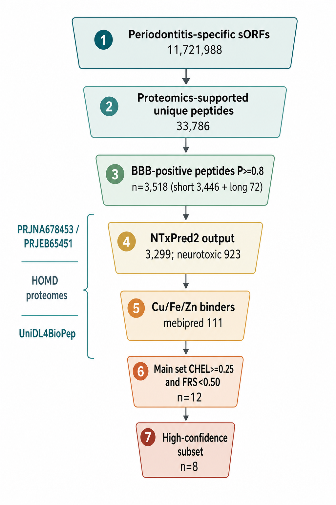

# Periodontitis-Specific Metaproteome Peptides as Alzheimer’s Disease Candidates: Blood–Brain Barrier, Metal Binding and Pro-oxidant Filters

# 牙周炎特异宏蛋白组肽作为阿尔茨海默病候选：血脑屏障、金属结合与促氧化筛选

**Manuscript type / 文体：** Research article with a mechanistic literature frame（以作者《材料与方法及结果_机制研究版》为方法–结果主体的 SCI 稿；综述文件提供机制语境）  
**Version / 版本：** v0.2 (2026-08-12) — **supersedes v0.1**  
**Branch / 分支：** `arena/019ff371-auto-empirical-research-skills`  
**Source spine / 源稿骨架：** `source-docs/材料与方法及结果_机制研究版.docx`（及同名 PDF）  
**Citation style / 文献格式：** Vancouver

> **What changed from v0.1.** The first draft was written before the local binaries were on the branch. It incorrectly built the results around GSE42872 and a published AChE–Aβ trajectory. Those files remain in `source-docs/` as a separate melanoma reanalysis and a translation of Atanasova et al., not as current AD results. The author’s own methods section states that docking, MD and QM/MM are **not** part of this stage.

---

## Abstract

Periodontitis and Alzheimer’s disease (AD) are linked in epidemiology, but the molecular cargo that would make the link peptide-level is still poorly enumerated. This paper writes an SCI methods-and-results narrative from a periodontitis-specific small open reading frame (sORF) screen. Oral metagenomic assemblies from BioProject PRJNA678453 and the companion high-resolution assembly PRJEB65451 supplied 296 metagenome-assembled genomes from 24 healthy and 26 periodontitis donors. After length filtering (4–50 amino acids), group-specific sORF libraries contained 11,269,961 healthy and 11,721,988 periodontitis sequences. Exact hash matching against HOMD-linked oral proteomes (PXD003151, PXD004319, PXD026727 and HOMD) left 31,510 and 33,786 non-redundant peptides, respectively (validation rates 0.2796% and 0.2882%). Peptides were split by length into a short branch (5–30 aa) and a long branch (31–50 aa) and scored with UniDL4BioPep (ESM-2 `esm2_t6_8M_UR50D`) at a high-confidence threshold of predicted probability ≥ 0.8. Blood–brain-barrier (BBB) positives were more numerous in periodontitis: 3,446 short and 72 long peptides, versus 3,359 and 40 in healthy donors. The 3,518 periodontitis BBB peptides (83.95% of the short branch sitting at 8–15 aa) were passed to NTxPred2, mebipred and AnOxPePred. NTxPred2, which does not accept sequences shorter than 7 aa, returned 3,299 scores and called 923 peptides neurotoxic, all ≤ 30 aa. Mebipred at 0.5 marked 111 Cu/Fe/Zn binders. AnOxPePred then retained 15 peptides with chelator score (CHEL) ≥ 0.25; requiring a scavenger score (FRS) < 0.50 left a **main set of 12**, and FRS < 0.45 left an **8-peptide high-confidence subset**. These twelve sequences are computational priorities for metal-linked pro-oxidant follow-up. They are not experimental proof of ROS generation, AChE binding or plaque nucleation. Docking to AChE (CAS/PAS and the published 344–361 Aβ residence patch), Aβ42, tau, ApoE4, ferritin and transferrin, and any MD or QM/MM work, are reserved for the next stage.

**Keywords:** periodontitis; sORF; metaproteome; UniDL4BioPep; blood–brain barrier; NTxPred2; mebipred; AnOxPePred; metal chelation; Alzheimer’s disease

## 摘要

牙周炎与阿尔茨海默病（AD）有流行病学关联，但能把关联落到肽水平的货物清单仍不完整。本稿按作者《材料与方法及结果_机制研究版》写成 SCI 方法–结果叙事。口腔宏基因组来自 PRJNA678453，高分辨率组装为 PRJEB65451，296 个高质量宏基因组组装基因组，覆盖 24 名健康对照和 26 名牙周炎患者。长度过滤（4–50 个氨基酸）后，组特异 sORF 库分别为健康 11,269,961 条、牙周炎 11,721,988 条。与 HOMD 相关口腔蛋白质组（PXD003151、PXD004319、PXD026727 及 HOMD）做哈希精确匹配并去重后，分别留下 31,510 和 33,786 条非冗余肽（验证通过率 0.2796% 与 0.2882%）。按长度分成短肽（5–30 aa）和长肽（31–50 aa），用 UniDL4BioPep（ESM-2 `esm2_t6_8M_UR50D`）打分，预测概率 ≥ 0.8 记为高置信阳性。血脑屏障（BBB）阳性在牙周炎组更多：短肽 3,446、长肽 72，健康组为 3,359 与 40。牙周炎 BBB 肽共 3,518 条（短肽中 83.95% 落在 8–15 aa），再送入 NTxPred2、mebipred 和 AnOxPePred。NTxPred2 不接收短于 7 aa 的序列，实际输出 3,299 条，其中 923 条判为神经毒性，且全部 ≤ 30 aa。mebipred 阈值 0.5 标出 111 条 Cu/Fe/Zn 结合阳性。AnOxPePred 上螯合分（CHEL）≥ 0.25 的有 15 条；再要求自由基清除分（FRS）< 0.50，得到 **主候选 12 条**；FRS < 0.45 得到 **高置信子集 8 条**。这十二条是后续金属相关促氧化研究的计算优先级，不等于已经证明产 ROS、结合 AChE 或成核斑块。对 AChE（CAS/PAS 及文献中的 344–361 Aβ 驻留区）、Aβ42、tau、ApoE4、铁蛋白和转铁蛋白的对接，以及分子动力学或 QM/MM，留到下一阶段。

**关键词：** 牙周炎；sORF；宏蛋白质组；UniDL4BioPep；血脑屏障；NTxPred2；mebipred；AnOxPePred；金属螯合；阿尔茨海默病

---

## 1. Introduction

### 1.1 From a keystone oral pathogen to a peptide inventory

Alzheimer’s disease is still defined by extracellular amyloid-β (Aβ), intracellular hyperphosphorylated tau, synapse loss and a cholinergic deficit [1,2]. The amyloid cascade remains the most economical account of autosomal-dominant disease [2]. Sporadic late-onset AD is less obedient. Infectious and metal-ion modifiers have been proposed for decades; both stall unless a molecule is named that can leave the mouth, enter brain, bind copper, iron or zinc, and touch Aβ, tau or acetylcholinesterase (AChE).

*Porphyromonas gingivalis* is a keystone pathogen of chronic periodontitis. Dominy et al. recovered gingipain antigens and bacterial DNA from AD cortex and cerebrospinal fluid, showed tau fragmentation by gingipains, and rescued hippocampal neurons in orally infected mice with brain-penetrant gingipain inhibitors [3]. Outer-membrane vesicles carry gingipains at three- to five-fold the surface density of the parent cell and are small enough to travel [4,5]. That literature names proteases and vesicles. It does not enumerate the much larger set of short peptides that an inflamed periodontal metagenome can encode.

The author’s companion review treats those peptides as the missing node between the infection hypothesis and the metal hypothesis of AD: sequences enriched in His, Cys, Asp/Glu and Tyr can coordinate Cu²⁺, Fe²⁺/Fe³⁺ and Zn²⁺, drive Fenton/Haber–Weiss chemistry, and, if they cross the blood–brain barrier, feed lipid peroxidation, microglial activation and Aβ/tau pathology [source-docs: 牙龈卟啉单胞菌肽与AD关联综述]. The present paper does not repeat that review as a catalogue of gingipain-cut tau fragments. It asks a narrower, countable question: after a periodontitis-specific sORF library is restricted to peptides that oral proteomes actually observe, how many survive a BBB filter, a neurotoxicity filter, a Cu/Fe/Zn filter, and a chelator-high / scavenger-low rule?

### 1.1 中文对照

阿尔茨海默病仍由细胞外 Aβ、细胞内过度磷酸化 tau、突触丢失和胆碱能缺损来定义 [1,2]。常染色体显性病例里，淀粉样级联仍然最省事 [2]。散发性晚发型不那么听话。感染和金属离子修饰因子提了几十年，两边都卡在同一处：说不出哪一个分子能离开口腔、进脑、绑住铜铁锌，并且碰到 Aβ、tau 或乙酰胆碱酯酶。

牙龈卟啉单胞菌是慢性牙周炎的关键病原。Dominy 等从 AD 皮层和脑脊液回收到牙龈蛋白酶抗原和菌源 DNA，证明牙龈蛋白酶切 tau，并用可入脑的抑制剂在口腔感染小鼠里保住海马神经元 [3]。外膜囊泡上的牙龈蛋白酶密度是菌体表面的三到五倍，也够小，适合走远 [4,5]。那摊文献点名的是蛋白酶和囊泡，没有把发炎牙周宏基因组能编码的短肽清点完。

作者那篇配套综述把这些肽当成感染假说和金属假说之间缺的节点：富含 His、Cys、Asp/Glu、Tyr 的序列能配位 Cu²⁺、Fe²⁺/Fe³⁺、Zn²⁺，驱动 Fenton/Haber–Weiss 化学；若再过血脑屏障，就喂给脂质过氧化、小胶质激活和 Aβ/tau 病理。本稿不把那篇综述再抄成 gingipain 切 tau 片段目录。它只问一个能数的问题：牙周炎特异 sORF 库被口腔蛋白质组真正看见的肽限制之后，过 BBB、神经毒性、Cu/Fe/Zn、以及“螯合高、清除低”这几道滤，还剩几条？

### 1.2 Objectives

1. Report the sORF-to-proteome collapse from PRJNA678453 / PRJEB65451 with the author’s own denominators.  
2. Report UniDL4BioPep high-confidence counts for short and long branches, healthy versus periodontitis, without pooling length classes.  
3. Report the three-model funnel that ends at 12 main and 8 high-confidence peptides.  
4. State, in the same tense as the source draft, what this stage does **not** compute: AChE/Aβ/tau docking, MD, QM/MM.

### 1.2 中文对照：目标

1. 用作者自己的分母写出 PRJNA678453 / PRJEB65451 从 sORF 塌缩到蛋白质组支持肽的过程。  
2. 短肽、长肽分开，健康对牙周炎，报告 UniDL4BioPep 高置信计数。  
3. 报告收到 12 条主候选、8 条高置信子集的三模型漏斗。  
4. 和源稿同一时态写明：本阶段不算 AChE/Aβ/tau 对接、分子动力学、QM/MM。

---

## 2. Methods

Methods follow the source draft. Figure 2 in the archive folder is a generic review pipeline; **Figure 5** is the funnel that matches these numbers.



**Figure 5.** Computational funnel from periodontitis-specific sORFs to the 12-peptide main set and 8-peptide high-confidence subset.  
**图 5.** 从牙周炎特异 sORF 到 12 条主候选、8 条高置信子集的计算漏斗。

### 2.1 sORF input and grouping

The screen starts from oral metagenomes deposited as BioProject PRJNA678453 [6] and the high-resolution assembly set PRJEB65451. The assembly collection comprises 296 high-quality metagenome-assembled genomes from 24 healthy controls and 26 periodontitis patients. Sample-specific mapping was used to build healthy-specific and periodontitis-specific sORF libraries. Sequences were kept if they translated to 4–50 amino acids. Raw library sizes were 11,269,961 (healthy) and 11,721,988 (periodontitis).

### 2.1 中文对照

研究起点是口腔宏基因组 PRJNA678453 [6] 和高分辨率组装 PRJEB65451。296 个高质量宏基因组组装基因组，来自 24 名健康对照和 26 名牙周炎患者。按样本特异映射分别建健康组和牙周炎组 sORF 库。翻译后长度留在 4–50 个氨基酸。原始库规模：健康 11,269,961，牙周炎 11,721,988。

### 2.2 Proteomic support and non-redundant sets

To raise the chance that a predicted micropeptide is actually expressed, candidate sequences were matched by hash-indexed exact identity to oral metaproteome peptides. Short-branch proteomes were PXD003151, PXD004319 and PXD026727; the long branch used HOMD. After dereplication the healthy set contained 31,510 peptides (30,557 short + 953 long) and the periodontitis set 33,786 (32,754 short + 1,032 long).

Table 2-1 in the source draft records the length mix of the proteome collections before group-specific collapse: the short-branch proteomes are 98.98% in 5–30 aa (462,257 / 467,002); HOMD is 98.40% longer than 50 aa (18,382,504 / 18,680,958), with 298,454 sequences in 31–50 aa. Downstream statistics therefore never pool the two branches.

### 2.2 中文对照

为提高微肽被表达过的把握，候选序列与口腔宏蛋白质组肽做哈希索引精确匹配。短肽分支蛋白质组为 PXD003151、PXD004319、PXD026727；长肽分支用 HOMD。去重后健康组 31,510 条（短 30,557 + 长 953），牙周炎组 33,786 条（短 32,754 + 长 1,032）。

源稿表 2-1 记录塌缩前蛋白质组的长度构成：短肽蛋白质组 98.98% 在 5–30 aa；HOMD 有 98.40% 长于 50 aa，31–50 aa 有 298,454 条。后面的统计从不把两支混在一个分母里。

### 2.3 Length branches

After proteomic dereplication, 5–30 aa sequences form the short branch and 31–50 aa sequences form the long branch. A few boundary sequences longer than 31 aa may still sit in files labelled “short”; all reported counts use the observed length bin, not the file name. UniDL4BioPep outputs are tallied separately for each branch.

### 2.3 中文对照

蛋白质组去重后，5–30 aa 为短肽支，31–50 aa 为长肽支。标成“短肽”的文件里仍可能有少量 31 aa 以上的边界序列；所有计数按实际长度分箱，不按文件名强行归类。UniDL4BioPep 两支分开统计。

### 2.4 UniDL4BioPep

Functional probabilities were computed with UniDL4BioPep, which embeds peptides with ESM-2 (`esm2_t6_8M_UR50D`) and classifies bioactivities with a convolutional head [7]. Categories included ACE inhibition, tumour T-cell antigen (TTCA), BBB, antiparasitic, neurotoxicity, antibacterial, antifungal, antiviral, toxicity, antioxidant free-radical scavenging, allergenicity, DPP-IV inhibition, cell-penetrating peptide, bitter, umami, broad antimicrobial, antimalarial, quorum sensing, anticancer and anti-MRSA. For category *c*,

\[
N_{\mathrm{high}}(c)=\sum_i \mathbf{1}\{P_i(c)\ge 0.8\}.
\]

The 0.8 cut is an operational high-confidence rule, not a calibrated posterior probability of wet-lab activity.

### 2.4 中文对照

功能概率用 UniDL4BioPep：ESM-2（`esm2_t6_8M_UR50D`）做嵌入，卷积头做二分类 [7]。类别见英文节。每个类别以预测概率 ≥ 0.8 记高置信阳性。0.8 是操作性阈值，不是湿实验活性的校准后验。

### 2.5 Three-model filter on BBB positives

Only peptides with BBB probability ≥ 0.8 entered NTxPred2, mebipred and AnOxPePred. NTxPred2 was run on sequences ≥ 7 aa; 5–6 aa peptides were left unscored because of the web-tool length limit. AnOxPePred supplied a free-radical scavenging score (FRS) and a chelator score (CHEL). Mebipred scored metal-binding potential, with Cu, Fe and Zn retained.

High CHEL and modest FRS was used as a priority rule for later metal-linked oxidative-stress work. The draft is explicit that this computational class is **not** experimental pro-oxidant activity.

### 2.5 中文对照

只有 BBB 概率 ≥ 0.8 的肽进入 NTxPred2、mebipred、AnOxPePred。NTxPred2 只跑 ≥ 7 aa；5–6 aa 因网页长度限制不判。AnOxPePred 给出自由基清除分（FRS）和螯合分（CHEL）。mebipred 评金属结合，留下 Cu、Fe、Zn。

CHEL 高、FRS 不高，作为后续金属相关氧化应激的优先规则。源稿写明：这个计算分类**不等于**实验促氧化活性。

### 2.6 What is not in this stage

The source draft lists AChE, BChE, Aβ42, tau, ApoE4, ferritin and transferrin as structural targets, with AChE attention on the catalytic anionic site (CAS), the peripheral anionic site (PAS) and the AChE–Aβ interface. It then states that the current stage does **not** perform docking, molecular dynamics or QM/MM/DFT on those targets or on metal ions. Section 4 of the draft is a protocol for the next tag, not a results section.

GSE42872 (vemurafenib in BRAF-V600E A375 melanoma [8]) and the Chinese translation of Atanasova et al.’s 1 μs AChE–Aβ trajectory [9] are archived beside this manuscript. They are not inputs to Tables 3-1 to 3-4.

### 2.6 中文对照：本阶段不算什么

源稿把 AChE、BChE、Aβ42、tau、ApoE4、铁蛋白、转铁蛋白列为结构靶，AChE 看 CAS、PAS 和 AChE–Aβ 界面。随即写明：当前阶段**不**对这些靶或金属离子做对接、分子动力学或 QM/MM/DFT。源稿第 4 节是下一阶段方案，不是结果。

GSE42872（BRAF-V600E A375 的维莫非尼实验 [8]）和 Atanasova 等 1 μs AChE–Aβ 轨迹的中译 [9] 与本稿放在同一档案夹，不进入表 3-1 至 3-4。

---

## 3. Results

### 3.1 Proteomic support

Merging branches, the raw sORF libraries were 11,269,961 (healthy) and 11,721,988 (periodontitis). Proteomic support and dereplication left 31,510 and 33,786 unique peptides (Table 1). Passage rates were 0.2796% and 0.2882%. Periodontitis contributed 51.75% of the combined confirmed library (65,296 peptides).

**Table 1.** Proteomic support of group-specific sORFs (source Table 3-1).

| Group | Specific sORFs | Unique proteome-supported peptides | Passage (%) | Share of confirmed library (%) |
| --- | ---: | ---: | ---: | ---: |
| Healthy | 11,269,961 | 31,510 | 0.2796 | 48.25 |
| Periodontitis | 11,721,988 | 33,786 | 0.2882 | 51.75 |
| Total | 22,991,949 | 65,296 | 0.2839 | 100.00 |

Almost all input sORFs have no exact proteome hit. That is expected for a 4–50 aa six-frame translation of 296 assemblies. The confirmed sets are the only denominators used below.

### 3.1 中文对照

合并两支后，原始 sORF 为健康 11,269,961、牙周炎 11,721,988。蛋白质组支持并去重后为 31,510 与 33,786（表 1）。通过率 0.2796% 与 0.2882%。牙周炎占合并确证库（65,296 条）的 51.75%。

绝大多数输入 sORF 没有精确蛋白质组命中。对 296 个组装做 4–50 aa 六框翻译，这是预期内的。下面只用确证集当分子。

### 3.2 BBB counts before the joint funnel

At BBB probability ≥ 0.8 the short branch yielded 3,359 healthy and 3,446 periodontitis peptides; the long branch yielded 40 and 72. Periodontitis is higher in absolute BBB-positive counts in both branches. Percentages of the proteome-supported long set are 4.20% versus 6.98%; of the short set, 10.99% versus 10.52%. The absolute periodontitis excess, not the short-branch percentage, is what feeds Section 3.5.

### 3.2 中文对照

BBB 概率 ≥ 0.8 时，短肽支健康 3,359、牙周炎 3,446；长肽支 40 与 72。两个分支里牙周炎的 BBB 阳性绝对数都更高。占蛋白质组支持长肽的比例是 4.20% 对 6.98%；短肽是 10.99% 对 10.52%。送进 3.5 节的是牙周炎绝对多余的那些肽，不是短肽支的百分比。

### 3.3 Long-branch UniDL4BioPep

Backgrounds are 953 healthy and 1,032 periodontitis long peptides. Table 2 reports every category at *P* ≥ 0.8.

**Table 2.** Long-peptide high-confidence UniDL4BioPep counts (source Table 3-2).

| Model | Healthy *n* | Healthy % | Periodontitis *n* | Periodontitis % |
| --- | ---: | ---: | ---: | ---: |
| ACP_Anticancer_alt | 91 | 9.55 | 121 | 11.72 |
| BBB_Peptides | 40 | 4.20 | 72 | 6.98 |
| Quorum_sensing | 173 | 18.15 | 190 | 18.41 |
| Antimicrobial | 206 | 21.62 | 238 | 23.06 |
| Antibacterial | 111 | 11.65 | 153 | 14.83 |
| Anti-MRSA | 47 | 4.93 | 62 | 6.01 |
| CPP | 15 | 1.57 | 29 | 2.81 |
| Antifungal | 73 | 7.66 | 96 | 9.30 |
| Toxicity | 13 | 1.36 | 18 | 1.74 |
| Umami | 17 | 1.78 | 15 | 1.45 |
| Antimalarial_alt | 12 | 1.26 | 14 | 1.36 |
| TTCA | 1 | 0.10 | 1 | 0.10 |
| Antioxidant_FRS | 43 | 4.51 | 41 | 3.97 |
| DPPIV | 0 | 0.00 | 0 | 0.00 |
| Antimalarial_main | 0 | 0.00 | 0 | 0.00 |
| Anti-parasitic | 288 | 30.22 | 280 | 27.13 |
| NeuroPred | 82 | 8.60 | 77 | 7.46 |
| ACP_Anticancer_main | 37 | 3.88 | 31 | 3.00 |
| ACE_inhibitory | 20 | 2.10 | 14 | 1.36 |
| Allergenicity | 16 | 1.68 | 11 | 1.07 |
| Antiviral | 55 | 5.77 | 52 | 5.04 |
| Bitter | 635 | 66.63 | 641 | 62.11 |

Periodontitis is higher for BBB, antibacterial, anti-MRSA, cell-penetrating and antifungal calls. Bitter is the most frequent call in both groups and is not treated as an AD phenotype.

### 3.3 中文对照

分母是健康长肽 953、牙周炎长肽 1,032。表 2 列出全部 *P* ≥ 0.8 的类别。牙周炎在 BBB、抗细菌、Anti-MRSA、细胞穿透、抗真菌上更高。苦味在两组都是最常见调用，不把它当 AD 表型。

### 3.4 Short-branch UniDL4BioPep

Backgrounds are 30,557 healthy and 32,754 periodontitis short peptides. Table 3 is the source table.

**Table 3.** Short-peptide high-confidence UniDL4BioPep counts (source Table 3-3).

| Model | Healthy *n* | Healthy % | Periodontitis *n* | Periodontitis % |
| --- | ---: | ---: | ---: | ---: |
| ACE_inhibitory_activity | 2,781 | 9.10 | 2,856 | 8.72 |
| TTCA | 9,123 | 29.86 | 9,161 | 27.97 |
| BBB_Peptides | 3,359 | 10.99 | 3,446 | 10.52 |
| APP_Anti-parasitic | 21,185 | 69.33 | 22,010 | 67.20 |
| NeuroPred | 3,876 | 12.68 | 4,019 | 12.27 |
| Antibacterial_AB | 9,269 | 30.33 | 9,273 | 28.31 |
| Antifungal_AF | 8,732 | 28.58 | 8,475 | 25.87 |
| AV_Antiviral | 7,501 | 24.55 | 7,221 | 22.05 |
| Toxicity_2021 | 2,770 | 9.07 | 2,751 | 8.40 |
| Antioxidant_FRS | 4,171 | 13.65 | 4,093 | 12.50 |
| Allergenicity | 8,599 | 28.14 | 9,422 | 28.77 |
| DPPIV_inhibitory_activity | 207 | 0.68 | 266 | 0.81 |
| CPP | 4,435 | 14.51 | 4,133 | 12.62 |
| Bitter | 5,037 | 16.48 | 4,986 | 15.22 |
| Umami | 6,095 | 19.95 | 6,094 | 18.61 |
| Antimicrobial_activity | 30,537 | 99.93 | 32,721 | 99.90 |
| Antimalarial_alt | 1,724 | 5.64 | 1,695 | 5.17 |
| Antimalarial_main | 6,496 | 21.26 | 6,586 | 20.11 |
| Quorum_sensing | 11,834 | 38.73 | 12,674 | 38.69 |
| ACP_Anticancer_alt | 7,878 | 25.78 | 8,380 | 25.58 |
| ACP_Anticancer_main | 11,370 | 37.21 | 12,023 | 36.71 |
| Anti-MRSA | 4,315 | 14.12 | 4,728 | 14.43 |

The source text highlights periodontitis **counts** for BBB (3,446), NeuroPred (4,019), Anti-MRSA (4,728) and quorum sensing (12,674). Percentages in those four rows are similar across groups; the periodontitis library is simply larger. Broad “antimicrobial_activity” is called on 99.9% of both short sets. That ceiling is reported as a model output. It is not interpreted here as evidence that essentially every oral peptide is an antibiotic.

### 3.4 中文对照

分母是健康短肽 30,557、牙周炎短肽 32,754。源稿强调牙周炎在 BBB（3,446）、NeuroPred（4,019）、Anti-MRSA（4,728）、群体感应（12,674）上的**条数**。这四行百分比两组接近，牙周炎库更大。广谱抗菌在两边都报到 99.9%。这个天花板按模型输出写，不解释成几乎每条口腔肽都是抗生素。

### 3.5 Joint BBB library used for AD triage

Restricting the periodontitis-oriented joint library to BBB ≥ 0.8 gave 3,518 peptides: 3,446 short (5–30 aa) and 72 long (31–50 aa). Of the short BBB set, 2,893 (83.95%) were 8–15 aa, 547 were 5–7 aa, and 6 were 16–30 aa. All 72 long peptides sit in 31–50 aa. The AD-oriented filter therefore mainly sees 8–15 aa sequences; HOMD long peptides are a small, separate branch.

### 3.5 中文对照

牙周炎取向的联合库按 BBB ≥ 0.8 留下 3,518 条：短肽 3,446，长肽 72。短肽 BBB 集里 2,893 条（83.95%）在 8–15 aa，547 条在 5–7 aa，6 条在 16–30 aa。72 条长肽全在 31–50 aa。面向 AD 的滤器主要看见 8–15 aa；HOMD 长肽是数量有限的独立支。

### 3.6 Three-model funnel

The 3,518 BBB peptides entered NTxPred2, mebipred and AnOxPePred (Table 4).

NTxPred2 does not accept < 7 aa, so 219 peptides were skipped and 3,299 were scored. Of those, 923 were called neurotoxic, all ≤ 30 aa. Subsequent metal and antioxidant tallies use the 3,299 scored sequences as the background, not the 3,518 BBB set.

Mebipred at 0.5 marked 111 Cu/Fe/Zn-positive peptides. Those 111 were submitted to AnOxPePred; three batches of `Chelator_All.txt` and `Scavenger_All.txt` were merged on SeqID so each peptide carried both CHEL and FRS.

CHEL ≥ 0.25 selected 15 peptides. Adding FRS < 0.50 left **12 main candidates**. Tightening to FRS < 0.45 left **8 high-confidence peptides**.

**Table 4.** Three-model funnel (source Table 3-4).

| Stage | Rule | *n* |
| --- | --- | ---: |
| BBB short | BBB ≥ 0.8, 5–30 aa | 3,446 |
| BBB long | BBB ≥ 0.8, 31–50 aa | 72 |
| BBB total | BBB ≥ 0.8 | 3,518 |
| NTxPred2 output | scored sequences (3,299 of 3,518) | 3,299 |
| Neurotoxic | NTxPred2 = Neurotoxic (all ≤ 30 aa) | 923 |
| Cu/Fe/Zn binders | mebipred 0.5 | 111 |
| CHEL ≥ 0.25 | AnOxPePred | 15 |
| Main set | CHEL ≥ 0.25 and FRS < 0.50 | **12** |
| High-confidence subset | CHEL ≥ 0.25 and FRS < 0.45 | **8** |

The 12-peptide list is the operational product of this stage. Sequences themselves are not printed in the source Word/PDF tables and are not invented here.

### 3.6 中文对照

3,518 条 BBB 肽进入三模型（表 4）。NTxPred2 不收 < 7 aa，跳过 219 条，打分 3,299 条，其中 923 条神经毒性阳性，全部 ≤ 30 aa。后面金属和抗氧化统计以 3,299 为背景，不用 3,518。

mebipred 0.5 标出 111 条 Cu/Fe/Zn 阳性。这 111 条送 AnOxPePred，三批 `Chelator_All.txt` 与 `Scavenger_All.txt` 按 SeqID 合并，每条同时有 CHEL 和 FRS。

CHEL ≥ 0.25 留下 15 条。加上 FRS < 0.50，得 **主候选 12 条**。收到 FRS < 0.45，得 **高置信 8 条**。

十二条是本阶段的操作性产物。源稿 Word/PDF 表里没有印出序列，这里也不编。

---

## 4. Discussion

### 4.1 What the counts support

Two numerical facts are robust to wording. First, proteomes throw away more than 99.7% of translated sORFs; AD claims that skip that collapse would be claims about six-frame noise. Second, a BBB-first, metal-second, scavenger-low rule reduces 33,786 periodontitis-supported peptides to 12. That is a prioritisation result. It is the correct grain size for a mechanism draft that has not yet docked anything.

The companion review’s chain—metagenomic peptide → metal coordination → Fenton chemistry → neurotoxicity—is the reason the CHEL-high / FRS-low cut exists [3–5]. A peptide that is predicted to bind copper or iron and is not predicted to be a strong radical scavenger is the one the next experiment should synthesise. The draft already says the cut does not equal ROS.

Short-branch percentages for BBB and NeuroPred barely move between healthy and periodontitis. What moves is the absolute periodontitis count, plus the long-branch BBB rate (4.20% → 6.98%). Any sentence that says “periodontitis peptides are more BBB-positive” should point to those two observations, not to the short-branch percentages.

### 4.1 中文对照

有两个数字经得起换说法。第一，蛋白质组丢掉 99.7% 以上的翻译 sORF；跳过这步塌缩去谈 AD，谈的是六框噪声。第二，先 BBB、再金属、再低清除，把 33,786 条牙周炎支持肽收到 12 条。这是排序结果，也是还没对接任何东西的机制稿该停的粒度。

配套综述那条链——宏基因组肽 → 金属配位 → Fenton → 神经毒性——是 CHEL 高 / FRS 低这一刀存在的理由。预测能绑铜或铁、又不被预测成强自由基清除剂的肽，才是下一实验该合成的。源稿已经写了：这一刀不等于 ROS。

短肽支 BBB、NeuroPred 的百分比在健康和牙周炎之间几乎不动。动的是牙周炎绝对条数，加上长肽支 BBB 率（4.20% → 6.98%）。凡写“牙周炎肽更会过 BBB”的句子，应对准这两处，而不是短肽百分比。

### 4.2 What the counts do not support

UniDL4BioPep labels are transferred from heterogeneous training sets [7]. A 99.9% antimicrobial call on short peptides is a prior of that head, not a biological census. NTxPred2’s length gate drops 219 BBB peptides before neurotoxicity is even asked. Mebipred at 0.5 is another operational cut. None of the twelve sequences has, in this draft, an ITC Kd, a DCFH-DA fold-change, or an AChE IC50.

Gingipain neuropathology [3] and AChE-accelerated Aβ fibril growth [9–11] remain the mechanistic backdrop, not results of this screen. Atanasova et al. kept Aβ on AChE for 1 μs and mapped the main residence to residues 344–361, next to PAS and poorly covered by dual-site inhibitors [9]. That patch is where the twelve peptides should be docked **next**. It is not where they have been docked.

GSE42872 is a six-sample melanoma vemurafenib microarray whose independent reanalysis (1,303 DE probes; MAPK output NES = −2.54) belongs in a methods-reproducibility folder [8]. Using it as an AD cortex dataset would be a dataset-identity error.

### 4.2 中文对照

UniDL4BioPep 的标签来自异构训练集 [7]。短肽 99.9% 抗菌是那个头的先验，不是生物学普查。NTxPred2 的长度门在问神经毒性之前就丢掉 219 条 BBB 肽。mebipred 0.5 也是操作性刀。这十二条在本稿里没有 ITC Kd、没有 DCFH-DA 倍数、没有 AChE IC50。

牙龈蛋白酶神经病理 [3] 和 AChE 加速 Aβ 成纤 [9–11] 仍是机制背景，不是这次筛选的结果。Atanasova 等让 Aβ 在 AChE 上坐满 1 μs，主驻留区在 344–361，挨着 PAS，又够远，双位点抑制剂不容易挡住 [9]。那块补丁是十二条**下一步**该对接的地方，不是已经对接过的地方。

GSE42872 是 6 样本黑色素瘤维莫非尼芯片，独立再分析（1,303 个差异探针；MAPK 输出 NES = −2.54）应放在方法复现文件夹 [8]。把它当 AD 皮层，是数据集身份错误。

### 4.3 Protocol already written for the next tag

Section 4 of the source draft is kept as the work plan, not executed here.

1. **Structure.** Multi-conformer models for 7–15 aa peptides; full-chain models for 31–50 aa; AlphaFold3 complexes with proteins and metal ions, judged by pLDDT and later MD, not treated as crystal structures.  
2. **Targets.** AChE (CAS, PAS, 344–361), BChE, Aβ42, tau, ApoE4, ferritin, transferrin.  
3. **Metals.** Cu²⁺, Fe²⁺/Fe³⁺, Zn²⁺; docking then MD on ligand–metal distances and coordination number; MM/GBSA or MM/PBSA for ranking; QM/MM or DFT only on stable coordination shells.  
4. **Wet lab.** Metal binding, Cu/Fe-dependent ROS, lipid peroxidation, AChE/BChE activity, Aβ aggregation, neuronal toxicity. The draft’s own stopping rule stands: only a peptide that raises ROS or lipid peroxidation **in the presence of metal** and damages neurons earns the phrase “metal-linked pro-oxidant neurotoxicity.”

A later local tag (`1yzy-manuscript-v0.3`) should paste the twelve sequences, their lengths, CHEL/FRS values and any docking poses into Section 3.6.

### 4.3 中文对照：源稿已经写好的下一阶段

源稿第 4 节当工作计划留着，本稿不执行。

1. **结构。** 7–15 aa 多构象；31–50 aa 全链；AlphaFold3 做肽–蛋白–金属复合物，用 pLDDT 和后续动力学判断，不当晶体。  
2. **靶点。** AChE（CAS、PAS、344–361）、BChE、Aβ42、tau、ApoE4、铁蛋白、转铁蛋白。  
3. **金属。** Cu²⁺、Fe²⁺/Fe³⁺、Zn²⁺；先对接再动力学看距离和配位数；MM/GBSA 或 MM/PBSA 排序；只有稳定配位壳才上 QM/MM 或 DFT。  
4. **湿实验。** 金属结合、Cu/Fe 依赖 ROS、脂质过氧化、AChE/BChE 酶活、Aβ 聚集、神经细胞毒性。源稿自己的停句保留：只有在**有金属**时抬高 ROS 或脂质过氧化、并且损伤神经元的肽，才配写“金属相关促氧化神经毒性”。

以后的本地 tag（`1yzy-manuscript-v0.3`）应把十二条序列、长度、CHEL/FRS 和对接姿势补进 3.6 节。

### 4.4 Limitations

Single-cohort assemblies (24 vs 26 donors); exact-match proteomics will miss one-residue variants; UniDL4BioPep / NTxPred2 / mebipred / AnOxPePred are used as black boxes at fixed cuts; no sequence table in the deposited Word/PDF; no new wet data. The bilingual text is meant to carry the same numbers; if one language is tighter, keep the tighter sentence.

### 4.4 中文对照：限制

单队列组装（24 对 26）；精确匹配蛋白质组会漏掉差一个残基的变体；四个预测器用固定阈值当黑箱；存档 Word/PDF 没有序列表；没有新的湿数据。中英文应运载同一组数字；若一句只在一种语言里更紧，留下更紧的那句。

---

## 5. Conclusions

A periodontitis-specific sORF screen, collapsed by oral proteomes and filtered for predicted BBB passage, Cu/Fe/Zn binding and a chelator-high / scavenger-low profile, yields twelve peptides (eight at the stricter FRS cut). That is the result. It is large enough to be a mechanism project and small enough to synthesise. It is not yet an AChE structure paper, not a gingipain immunohistochemistry paper, and not a melanoma microarray paper. Those three files stay in the same git folder because they share a desk, not because they share a denominator.

## 5. 结论

牙周炎特异 sORF 经口腔蛋白质组塌缩，再按预测 BBB、Cu/Fe/Zn 结合和“螯合高、清除低”过滤，得到十二条肽（更严的 FRS 刀下是八条）。这就是结果。大到够做一个机制项目，小到够合成。它还不是 AChE 结构论文，不是牙龈蛋白酶免疫组化论文，也不是黑色素瘤芯片论文。那三份文件和本稿放在同一个 git 文件夹，是因为同一张书桌，不是因为同一个分母。

---

## Declarations / 声明

**Data / 数据。** PRJNA678453, PRJEB65451, PXD003151, PXD004319, PXD026727 and HOMD are public. Author tables live in `projects/1yzy-pg-ad-mechanism/source-docs/`.  
**Funding / Conflicts / Ethics.** None recorded for this archival write-up; no new human or animal work.  
**Supersession.** v0.1 (commit `862fd10`) is retained in git history only.

---

## References / 参考文献

1. Scheltens P, De Strooper B, Kivipelto M, Holstege H, Chételat G, Teunissen CE, et al. Alzheimer's disease. Lancet. 2021;397(10284):1577-1590. doi:10.1016/S0140-6736(20)32205-4  
2. Selkoe DJ, Hardy J. The amyloid hypothesis of Alzheimer's disease at 25 years. EMBO Mol Med. 2016;8(6):595-608. doi:10.15252/emmm.201606210  
3. Dominy SS, Lynch C, Ermini F, Benedyk M, Marczyk A, Konradi A, et al. *Porphyromonas gingivalis* in Alzheimer's disease brains: evidence for disease causation and treatment with small-molecule inhibitors. Sci Adv. 2019;5(1):eaau3333. doi:10.1126/sciadv.aau3333  
4. Ho MH, Chen CH, Goodwin JS, Wang BY, Xie H. Functional advantages of *Porphyromonas gingivalis* vesicles. PLoS One. 2015;10(4):e0123448. doi:10.1371/journal.pone.0123448  
5. Nara PL, Sindelar D, Penn MS, Potempa J, Griffin WST. *Porphyromonas gingivalis* outer membrane vesicles as the major driver of and explanation for neuropathogenesis, the cholinergic hypothesis, iron dyshomeostasis, and salivary lactoferrin in Alzheimer's disease. J Alzheimers Dis. 2021;82(4):1417-1450. doi:10.3233/JAD-210448  
6. Belstrøm D, Constancias F, Markvart M, Sikora M, Sørensen CE, Givskov M. Periodontitis associates with species-specific gene expression of the oral microbiota. npj Biofilms Microbiomes. 2021;7:76. doi:10.1038/s41522-021-00247-y  
7. Du Z, Ding X, Xu Y, Li Y. UniDL4BioPep: a universal deep learning architecture for binary classification in peptide bioactivity. Brief Bioinform. 2023;24(3):bbad135. doi:10.1093/bib/bbad135  
8. Parmenter TJ, Kleinschmidt M, Kinross KM, Bond ST, Li J, Kaadige MR, et al. Response of BRAF-mutant melanoma to BRAF inhibition is mediated by a network of transcriptional regulators of glycolysis. Cancer Discov. 2014;4(4):423-433. doi:10.1158/2159-8290.CD-13-0440  
9. Atanasova M, Dimitrov I, Ivanov S. Molecular dynamics simulations of acetylcholinesterase – beta-amyloid peptide complex. Cybern Inf Technol. 2020;20(6):140-154. doi:10.2478/cait-2020-0068  
10. Inestrosa NC, Alvarez A, Pérez CA, Moreno RD, Vicente M, Linker C, et al. Acetylcholinesterase accelerates assembly of amyloid-β-peptides into Alzheimer's fibrils: possible role of the peripheral site of the enzyme. Neuron. 1996;16(4):881-891. doi:10.1016/s0896-6273(00)80108-7  
11. De Ferrari GV, Canales MA, Shin I, Weiner LM, Silman I, Inestrosa NC. A structural motif of acetylcholinesterase that promotes amyloid β-peptide fibril formation. Biochemistry. 2001;40(35):10447-10457. doi:10.1021/bi0101392  

Author source documents (not journal articles):  
- 材料与方法及结果_机制研究版.docx / .pdf  
- 牙龈卟啉单胞菌肽与AD关联综述.docx  
- 乙酰胆碱酯酶-β-淀粉样肽复合物分子动力学模拟_中文翻译.docx  
- GSE42872_论文.docx；GSE42872_代码方法.docx  

---

## Appendix. Skills and tags / 附录

Routed via repository `SKILL.md`: literature-review, PRISMA reporting items that apply, scientific-writing, Chinese de-AIGC.

```text
1yzy-manuscript-v0.1   # pre-source reconstruction (do not submit)
1yzy-sourcedocs-v0.1   # 9c51ae1 ingest
1yzy-manuscript-v0.2   # this file, numbers from 机制研究版
```
