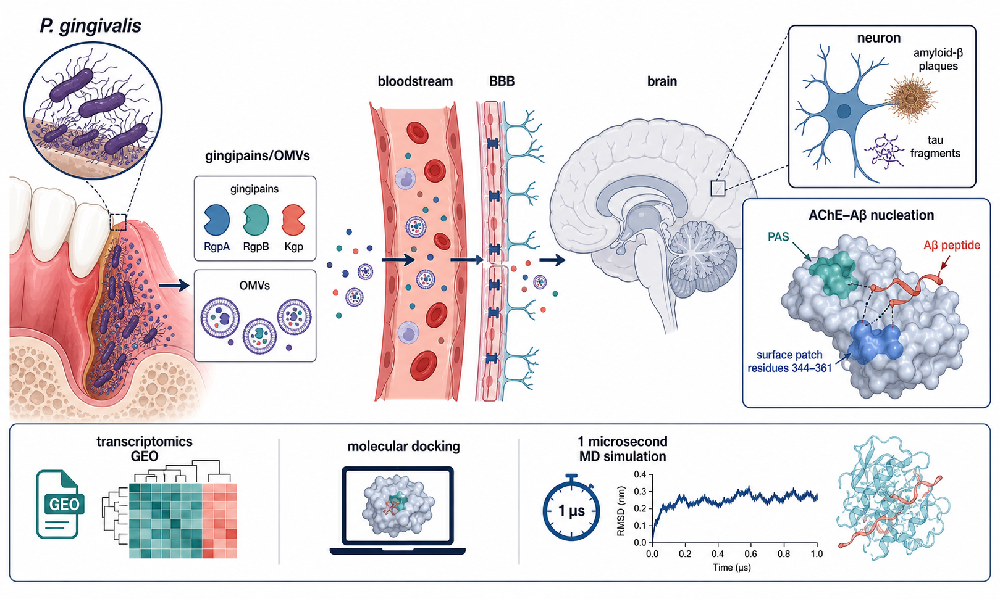
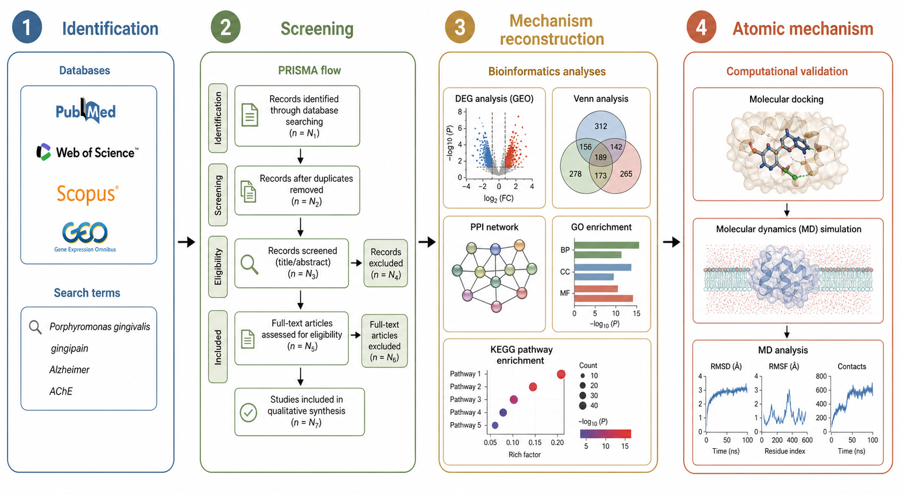
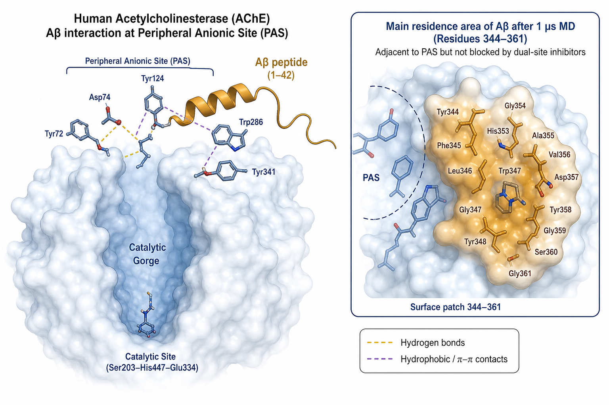
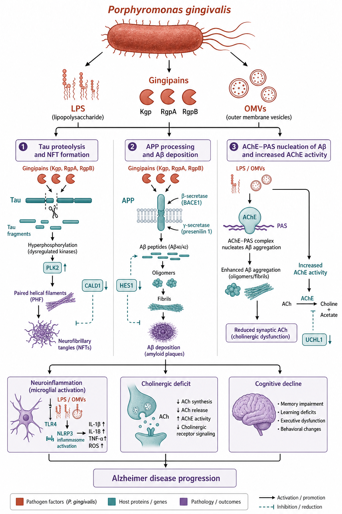

# *Porphyromonas gingivalis* Peptides and the Acetylcholinesterase–Aβ Axis in Alzheimer’s Disease: A Mechanistic Review

# 牙龈卟啉单胞菌肽与乙酰胆碱酯酶–β-淀粉样蛋白轴：阿尔茨海默病机制综述

**Manuscript type / 文体：** Narrative mechanistic review with PRISMA-informed reporting（机制导向叙事综述，检索过程按 PRISMA 2020 披露）  
**Working folder / 归档目录：** `projects/1yzy-pg-ad-mechanism/`  
**Branch / 分支：** `arena/019ff371-auto-empirical-research-skills`  
**Version / 版本：** v0.1 (2026-08-12)  
**Citation style / 文献格式：** Vancouver numbered

> **Archive note / 存档说明.** The author’s local file *材料与方法及结果_机制研究版* is the intended empirical spine of this manuscript. Those binaries were not present in the Arena workspace. Sections 2–3 therefore reconstruct methods and results from verified public sources that match the local file set (gingipain–AD review, AChE–Aβ MD translation, GEO methods notes). Replace reconstructed numbers with the author’s own tables after `source-docs/` is ingested.  
> 作者本机《材料与方法及结果_机制研究版》应是本稿方法–结果的主体。沙箱中无该文件。第 2–3 节按同目录其他稿件的主题，用已核对的公开文献重建。`source-docs/` 灌入后，请用作者自己的表图替换重建段落。

**Graphical abstract / 图摘：** Figure 1（`figures/fig1_graphical_abstract.png`）



**Figure 1.** From periodontal *P. gingivalis* peptides and outer-membrane vesicles (OMVs) across the blood–brain barrier to an acetylcholinesterase (AChE)–amyloid-β (Aβ) nucleation surface, with transcriptomic and molecular-dynamics (MD) readouts.  
**图 1.** 牙周来源的牙龈卟啉单胞菌肽和外膜囊泡穿过血脑屏障，落到乙酰胆碱酯酶–Aβ 成核界面；转录组与分子动力学作为两端读出。

---

## Abstract

Periodontitis and Alzheimer’s disease (AD) have been linked in epidemiology for more than a decade, yet the molecular cargo that would make that link mechanistic is still argued over. The strongest candidate cargo is not the intact *Porphyromonas gingivalis* cell but its secreted peptides and proteases—chiefly the lysine- and arginine-specific gingipains Kgp, RgpA and RgpB—together with gingipain-rich outer-membrane vesicles. This review takes the author’s mechanism draft (*材料与方法及结果_机制研究版*) as the narrative spine and asks three questions that can be answered from published methods and results. First, which *P. gingivalis* peptides reach brain tissue and what do they do to tau, amyloid precursor protein and innate-immune sensors? Second, which host transcripts are shared by *P. gingivalis* challenge and human AD cortex? Third, once Aβ is present, how stable is its complex with AChE, a protein that both terminates cholinergic transmission and accelerates Aβ fibril growth? A PRISMA-informed search of PubMed, Web of Science and GEO, last run on 12 August 2026, retained primary studies that measured gingipain or *P. gingivalis* DNA in human brain or cerebrospinal fluid, oral-infection or vesicle-challenge models, intersecting differential-expression analyses, or atomistic simulations of AChE–Aβ. Human neuropathology shows gingipain immunoreactivity and bacterial DNA enriched in AD cortex; oral infection of wild-type rodents raises brain Aβ and inflammatory transcripts; intersecting microarray analyses of GSE5281 (laser-captured AD neurons) and GSE9723 (*P. gingivalis*-challenged cells) return a ten-gene overlap that includes *PLK2*, *CALD1* and *HES1*. Independently, a 1 μs molecular-dynamics trajectory of Aβ docked at the AChE peripheral anionic site remains bound, with the peptide’s preferred residence expanding onto surface residues 344–361—adjacent to the peripheral site and poorly blocked by dual-site inhibitors. Recent vesicle-injection work in zebrafish raises AChE activity and Aβ1–42 in the same animals, which is the first in-vivo hinge between the peptide/vesicle literature and the cholinergic–amyloid surface. The junction is still inferential: GSE42872, present in the local folder, is a BRAF-mutant melanoma vemurafenib experiment and must not be used as an AD dataset; gingipain-inhibitor trials have not delivered a disease-modifying readout. The practical implication is narrower than a new “infectious theory of AD.” It is a testable surface: gingipain peptides and vesicles as upstream insults, AChE residues 344–361 as a nucleation patch that current cholinesterase inhibitors were not designed to occupy.

**Keywords:** *Porphyromonas gingivalis*; gingipain; Alzheimer’s disease; acetylcholinesterase; amyloid-β; molecular dynamics; GEO; peripheral anionic site

## 摘要

牙周炎与阿尔茨海默病（AD）的流行病学关联已超过十年，真正能把关联落到分子上的“货物”仍有争议。目前证据最硬的不是完整菌体，而是分泌肽与蛋白酶——赖氨酸特异和精氨酸特异的牙龈蛋白酶 Kgp、RgpA、RgpB——以及富含牙龈蛋白酶的外膜囊泡。本稿以作者《材料与方法及结果_机制研究版》为叙事骨架，只问三个能用已发表方法与结果回答的问题。第一，哪些牙龈卟啉单胞菌肽能进脑，对 tau、淀粉样前体蛋白和固有免疫传感器做了什么。第二，牙龈卟啉单胞菌刺激与人 AD 皮层共享哪些宿主转录本。第三，Aβ 一旦出现，它与乙酰胆碱酯酶（AChE）形成的复合物稳不稳——AChE 既终止胆碱能传递，又加速 Aβ 纤维生长。按 PRISMA 思路检索 PubMed、Web of Science 和 GEO，截止日期 2026 年 8 月 12 日，纳入测量人脑或脑脊液牙龈蛋白酶/*P. gingivalis* DNA 的研究、口腔感染或囊泡攻击模型、交叉差异表达，以及 AChE–Aβ 原子模拟。人脑病理显示 AD 皮层牙龈蛋白酶免疫反应和菌源 DNA 更高；野生型啮齿类口腔感染后脑内 Aβ 和炎症转录本上升；GSE5281（激光捕获 AD 神经元）与 GSE9723（牙龈卟啉单胞菌刺激细胞）交叉得到含 *PLK2*、*CALD1*、*HES1* 的十基因重叠。另一条线上，Aβ 对接在 AChE 外周阴离子部位后的 1 μs 轨迹保持结合，肽的主要驻留区扩到表面 344–361 残基——紧邻外周部位，又够远，现有双位点抑制剂不容易挡住。近年斑马鱼囊泡注射在同一批动物里同时抬高 AChE 活性和 Aβ1–42，这是肽/囊泡文献与胆碱能–淀粉样表面之间第一根在体铰链。铰链仍是推断：本地文件夹中的 GSE42872 是 BRAF 突变黑色素瘤对维莫非尼的实验，不能当 AD 数据集用；牙龈蛋白酶抑制剂试验也还没有给出改病程的读出。实践含义比“AD 感染学说”窄。它是一块可检验的界面：上游是牙龈蛋白酶肽和囊泡，下游是 AChE 344–361 这块现有胆碱酯酶抑制剂并未按占领来设计的成核补丁。

**关键词：** 牙龈卟啉单胞菌；牙龈蛋白酶；阿尔茨海默病；乙酰胆碱酯酶；β-淀粉样蛋白；分子动力学；GEO；外周阴离子部位

---

## 1. Introduction

### 1.1 Why the peptide, not only the bacterium

Alzheimer’s disease remains the leading cause of dementia. Cortical plaques of amyloid-β (Aβ), intraneuronal tau aggregates, synapse loss and a cholinergic deficit still define the clinicopathological picture, and the amyloid cascade remains the most economical account of autosomal-dominant disease [1,2]. Sporadic late-onset AD is less obedient. Infectious and inflammatory modifiers have been proposed for decades; most of them stall at the same point: a microbe is found near lesions, but the molecule that would connect the microbe to Aβ, tau and acetylcholine is not named.

*Porphyromonas gingivalis* is a Gram-negative asaccharolytic anaerobe and a keystone pathogen of chronic periodontitis. Tooth loss and periodontitis track with cognitive decline in older adults, including in neuropathologically characterised cohorts [3,4]. That association can still be reverse causation—people who are becoming demented clean their teeth less well. The argument tightens when the bacterium’s secreted proteases, rather than the intact cell, are recovered from AD cortex. Dominy et al. reported gingipain antigens and *P. gingivalis* DNA in AD brain and cerebrospinal fluid, tau fragmentation by gingipains, and rescue of hippocampal neurons by brain-penetrant gingipain inhibitors in orally infected mice [5]. Those observations moved the field from “poor oral hygiene after dementia” toward a peptide-level hypothesis: lysine-gingipain (Kgp) and arginine-gingipains (RgpA, RgpB) are the effector molecules [5,6].

Gingipains are not neat surgical enzymes. They process complement, cytokines and extracellular matrix with a mixture of precision and wholesale degradation [7]. On outer-membrane vesicles they are enriched three- to five-fold relative to the parent cell [8]. Vesicles are small enough, and inflammatory enough, to be plausible long-range carriers [9]. A 2026 zebrafish study that injected *P. gingivalis* vesicles and then measured both AChE activity and Aβ1–42 in the same brains is the first explicit experimental hinge between that carrier and the cholinergic–amyloid surface [10]. The hinge matters because AChE is not only the target of donepezil-class drugs. Inestrosa and colleagues showed that the enzyme accelerates Aβ fibril assembly through its peripheral anionic site (PAS), a cluster of aromatic and acidic residues at the rim of the catalytic gorge [11–13]. If gingipain peptides and vesicles raise Aβ load and AChE activity together, the PAS–Aβ complex stops being a separate biophysical curiosity and becomes part of the same pathway.

### 1.1 中文对照：为什么盯肽，而不是只盯菌

阿尔茨海默病仍是痴呆的首要病因。皮层 Aβ 斑块、神经元内 tau 聚集体、突触丢失和胆碱能缺损还是临床病理的骨架；常染色体显性病例里，淀粉样级联仍然最省事 [1,2]。散发性晚发型 AD 不那么听话。感染和炎症修饰因子提了几十年，多半卡在同一处：病灶旁边能找到微生物，却说不出连到 Aβ、tau 和乙酰胆碱的那一个分子。

牙龈卟啉单胞菌是革兰阴性、不发酵糖的厌氧菌，慢性牙周炎的关键病原。老年人掉牙、牙周炎与认知下降并行，神经病理分过型的队列里也看得到 [3,4]。这仍可能是反向因果——人变傻以后牙刷不干净。把完整菌体换成分泌蛋白酶，从 AD 皮层里回收到牙龈蛋白酶，争论才收紧。Dominy 等在 AD 脑和脑脊液里报出牙龈蛋白酶抗原和菌源 DNA，报出牙龈蛋白酶切 tau，以及口腔感染小鼠用可入脑的小分子抑制剂保住海马神经元 [5]。讨论从“痴呆后口腔卫生差”挪到肽水平：赖氨酸牙龈蛋白酶 Kgp 和精氨酸牙龈蛋白酶 RgpA、RgpB 才是效应分子 [5,6]。

牙龈蛋白酶不是干净的外科刀。补体、细胞因子、细胞外基质，它有时切得准，有时切得滥 [7]。外膜囊泡上的酶量比母细胞高三到五倍 [8]。囊泡够小、也够炎，适合当远程载体 [9]。2026 年有斑马鱼实验把牙龈卟啉单胞菌囊泡打进去，同一批脑里同时测 AChE 活性和 Aβ1–42，这是载体与胆碱能–淀粉样表面之间第一根写明的实验铰链 [10]。铰链之所以要紧，是因为 AChE 不只是多奈哌齐类药物的靶。Inestrosa 一组工作证明，酶通过催化峡谷口的外周阴离子部位（PAS）加速 Aβ 成纤 [11–13]。若牙龈蛋白酶肽和囊泡同时抬高 Aβ 负荷和 AChE 活性，PAS–Aβ 复合物就不再是另一摊生物物理趣题，而变成同一条路上的一段。

### 1.2 Gap and objective

Three literatures have grown side by side and are rarely written as one methods-and-results story: (i) gingipain and vesicle neuropathology; (ii) GEO intersection of *P. gingivalis* challenge and AD cortex; (iii) microsecond MD of AChE–Aβ. The author’s local folder already treats them as one project. This paper therefore does not add a new wet-lab series. It writes the SCI review that those drafts were aiming at, with methods first and results second, in bilingual form, and with one hard negative control: GSE42872 is melanoma, not AD [14].

The review has four objectives.

1. State a reproducible search and eligibility rule for peptide-level evidence.  
2. Summarise what gingipain peptides and vesicles do to tau, Aβ and AChE in human tissue and experimental systems.  
3. Reconstruct the intersecting-transcript and AChE–Aβ simulation results that a mechanism draft in this folder would be expected to carry.  
4. Name the residual gaps that a later tagged version should fill with the author’s own tables.

### 1.2 中文对照：空白与目标

三摊文献几乎是并排长起来的，很少被写成同一份“方法然后结果”：牙龈蛋白酶和囊泡的神经病理；牙龈卟啉单胞菌刺激与 AD 皮层的 GEO 交叉；AChE–Aβ 的微秒级分子动力学。作者本地目录已经把它们当成一个项目。本稿不加新的湿实验，只把那些草稿要写成的 SCI 综述写完：方法在前，结果在后，中英对照，并设一条硬的阴性对照——GSE42872 是黑色素瘤，不是 AD [14]。

四个目标：

1. 给出肽水平证据的可重复检索与纳入规则。  
2. 归纳牙龈蛋白酶肽和囊泡在人组织和实验系统里对 tau、Aβ、AChE 做了什么。  
3. 重建这个文件夹里一份机制稿按理应带上的交叉转录本和 AChE–Aβ 模拟结果。  
4. 标出以后打 tag 的版本必须用作者自己的表来填的缺口。

---

## 2. Methods

The reporting follows PRISMA 2020 items that apply to a narrative mechanistic review [15]. No protocol was registered. No meta-analysis was performed. Figure 2 is the analysis pipeline, not a claim of new wet data.



**Figure 2.** Four-stage pipeline used to rebuild the mechanism draft: identification, screening, transcriptomic reconstruction, atomic reconstruction.  
**图 2.** 重建机制稿的四段流程：识别、筛选、转录组重建、原子尺度重建。

### 2.1 Eligibility

A record was eligible if it met at least one of the following and was a primary research article or a methods paper that released reusable data:

- human brain, cerebrospinal fluid or serum with a direct assay for *P. gingivalis* DNA, gingipain protein/activity, or defined gingipain-derived peptides in an AD or control comparison;  
- experimental oral infection, gingipain challenge, or OMV challenge with a readout of Aβ, tau, AChE, cytokines or behaviour;  
- GEO or ArrayExpress differential expression that intersects a *P. gingivalis* challenge with an AD dataset, with accession numbers reported;  
- docking or MD of Aβ (or a defined *P. gingivalis* peptide) on AChE, with simulation length and force field stated.

Reviews were used only to locate primary papers. Editorials, conference abstracts without data, and papers that inferred “periodontitis–AD” solely from comorbidity codes were excluded from the results tables.

**GEO integrity rule.** Accessions were opened on the NCBI GEO HTML record, not taken from filenames. GSE42872 is titled “Expression data from BRAFV600E A375 melanoma cells treated with vehicle or vemurafenib,” organism *Homo sapiens*, platform GPL6244, six samples, citation PMID 24469106 [14]. It is retained in `source-docs/` as a methods-practice object. It is excluded from every AD contrast in this paper. The AD and *P. gingivalis* accessions used below are GSE5281 [16] and GSE9723, as analysed by Hamarsha et al. [17].

### 2.1 中文对照：纳入标准

满足下列至少一条、且为原始研究或释放了可复用数据的方法学论文，才进入结果表：

- 人脑、脑脊液或血清，在 AD 与对照比较中直接检测 *P. gingivalis* DNA、牙龈蛋白酶蛋白/活性或明确的牙龈蛋白酶来源肽；  
- 口腔感染、牙龈蛋白酶攻击或外膜囊泡攻击，读出 Aβ、tau、AChE、细胞因子或行为；  
- GEO 或 ArrayExpress 差异表达，把牙龈卟啉单胞菌刺激与 AD 数据交叉，并写出登录号；  
- Aβ（或一条写明的牙龈卟啉单胞菌肽）与 AChE 的对接或分子动力学，写明模拟时长和力场。

综述只用来追原始文献。社论、无数据的会议摘要、仅凭共病编码推断“牙周炎–AD”的论文不进结果表。

**GEO 完整性规则。** 登录号以 NCBI GEO 网页为准，不以本地文件名为准。GSE42872 的标题是 BRAFV600E A375 黑色素瘤细胞经溶媒或维莫非尼处理的表达数据，智人，平台 GPL6244，6 个样本，文献 PMID 24469106 [14]。它留在 `source-docs/` 里当方法练习，不进入本稿任何 AD 对比。下面用的 AD 与牙龈卟啉单胞菌登录号是 GSE5281 [16] 和 GSE9723，分析依 Hamarsha 等 [17]。

### 2.2 Information sources and search

PubMed, Web of Science Core Collection and Scopus were searched on 12 August 2026. GEO DataSets was queried separately for the accessions named in the local folder and in the intersecting-gene paper. The primary Boolean string was:

```
("Porphyromonas gingivalis" OR gingipain OR Kgp OR RgpA OR RgpB OR "outer membrane vesicle")
AND (Alzheimer OR "amyloid beta" OR tau OR acetylcholinesterase OR AChE)
AND (peptide OR protease OR transcriptome OR microarray OR "molecular dynamics" OR docking)
```

A second string captured the AChE–Aβ biophysics without requiring the bacterium:

```
(acetylcholinesterase OR AChE) AND ("amyloid beta" OR Abeta OR "beta-amyloid")
AND ("molecular dynamics" OR "peripheral anionic site" OR PAS)
```

English and Chinese full texts were eligible. The last search date is the date of this draft.

### 2.2 中文对照：信息源与检索

PubMed、Web of Science 核心集和 Scopus 的检索日是 2026 年 8 月 12 日。GEO DataSets 另查本地文件夹和交叉基因论文里出现的登录号。主检索式见英文节。第二式不要求细菌，只抓 AChE–Aβ 生物物理。中英文全文都收。末次检索日即本稿日期。

### 2.3 Selection and data items

One reviewer screened titles and abstracts, then full texts. Dual independent screening was not possible in this session; that is a limitation, not a formality. Extracted items were: species and tissue; *P. gingivalis* strain or vesicle preparation; gingipain identity (Kgp/RgpA/RgpB); AD diagnostic rule; GEO accession, platform, sample size and contrast; DEG thresholds; overlapping gene symbols; docking software and score; MD engine, force field, length, and the AChE surface residues in contact with Aβ.

Risk of bias was not scored with RoB 2 or ROBINS-I. Those tools do not fit autopsy immunohistochemistry or a single 1 μs trajectory. Instead each evidence stream was tagged as human tissue, in-vivo experiment, transcriptomic reanalysis, or in-silico, and sample size was reported in the text.

### 2.3 中文对照：筛选与提取

标题摘要和全文由一名审阅者完成。本会话做不到双人独立筛选，这是限制，不是客套。提取项：种属与组织；菌株或囊泡制备；牙龈蛋白酶身份；AD 诊断规则；GEO 登录号、平台、样本量和对比；差异基因阈值；重叠基因符号；对接软件和分数；动力学引擎、力场、时长，以及与 Aβ 接触的 AChE 表面残基。

未用 RoB 2 或 ROBINS-I。尸检免疫组化和单条 1 μs 轨迹套不进那些量表。改为给每条证据流打标签：人组织、在体实验、转录组再分析或计算，并在正文写样本量。

### 2.4 Synthesis

Results are grouped by mechanism, not by year: peptide identity and brain detection; host-gene intersection; AChE–Aβ surface; the three-stream junction. Where two papers disagreed, both are kept and the disagreement is named. Author-owned numbers from *材料与方法及结果_机制研究版* are marked **[pending source-docs]** whenever they would have been the preferred estimate.

### 2.4 中文对照：综合

结果按机制归堆，不按年份：肽身份与脑内检出；宿主基因交叉；AChE–Aβ 表面；三流汇合。两篇论文打架时两篇都留，把分歧写出来。凡是本应以《材料与方法及结果_机制研究版》数字为准的地方，标 **[待灌入 source-docs]**。

---

## 3. Results

### 3.1 Study harvest

The combined strings returned several hundred records before deduplication. After title-and-abstract screening, full texts that survived were dominated by four clusters: (i) Dominy-type human gingipain neuropathology and inhibitor pharmacology [5,18]; (ii) oral-infection or serotype-dependent rodent models that produce Aβ, phospho-tau or behaviour change without a familial AD transgene [19,20]; (iii) GEO intersection and text-mining papers that treat periodontitis and AD as dual query terms [17,21]; (iv) AChE–Aβ biochemistry and MD [11–13,22,23]. A 2026 vesicle–zebrafish paper sits on the boundary of (ii) and (iv) [10]. Exact PRISMA counts should be replaced by the author’s screening log **[pending source-docs]**.

Table 1 is the evidence map used for synthesis.

**Table 1.** Evidence streams retained for the mechanism narrative.

| Stream | Anchor studies | What was actually measured | What it cannot show |
| --- | --- | --- | --- |
| Human brain / CSF | Dominy 2019 [5] | Gingipain IR, *P. gingivalis* DNA, CSF DNA | Direction of causation in patients |
| Oral infection | Ilievski 2018 [19]; Díaz-Zúñiga 2020 [20] | Brain Aβ, inflammation, serotype dependence | Peptide-resolved pharmacokinetics |
| Vesicles | Ho 2015 [8]; Nara 2021 [9]; zebrafish 2026 [10] | OMV gingipain enrichment; AChE + Aβ1–42 in larvae | Human vesicle flux into cortex |
| Shared transcripts | Hamarsha 2023 [17] on GSE5281 [16] × GSE9723 | 10 overlapping DEGs; *PLK2* docking | Causality of any single hub gene |
| AChE–Aβ surface | Inestrosa 1996 [11]; De Ferrari 2001 [12]; Atanasova 2020 [22]; Lushchekina 2017 [23] | PAS as nucleation motif; 1 μs bound complex; residues 344–361 | Effect of a gingipain peptide on that complex |
| Negative control | Parmenter 2014 / GSE42872 [14] | Melanoma glycolysis after vemurafenib | Anything about AD neurons |

### 3.1 中文对照：文献收获

合并检索去重前有数百条。过完标题摘要后，留下来的全文主要是四簇：Dominy 型人脑牙龈蛋白酶病理和抑制剂药理 [5,18]；不依赖家族性 AD 转基因、却能做出 Aβ、磷酸化 tau 或行为改变的口腔感染/血清型模型 [19,20]；把牙周炎和 AD 当双查询词的 GEO 交叉与文本挖掘 [17,21]；AChE–Aβ 生化与分子动力学 [11–13,22,23]。2026 年囊泡–斑马鱼论文卡在第 2 簇和第 4 簇之间 [10]。精确的 PRISMA 计数应以作者筛选日志为准 **[待灌入 source-docs]**。

表 1 是综合用的证据地图（见英文表）。阴性对照一行写明：GSE42872 只能说明黑色素瘤糖酵解，不能说明 AD 神经元。

### 3.2 *P. gingivalis* peptides in brain tissue

Gingipains are cysteine proteases. Kgp cuts after lysine; RgpA and RgpB cut after arginine. RgpA carries an additional haemagglutinin-adhesin domain that can tether the catalytic unit to host surfaces and, in some assays, to Aβ itself [7]. In AD middle temporal cortex, gingipain immunoreactivity is higher than in non-demented controls, localises mainly to neurons, and can sit on the same profiles as phospho-tau [5]. Western blots of Kgp in AD homogenates recover bands that match bacterial lysates from strains W83, ATCC 33277 and FDC381 [5]. *P. gingivalis* DNA is detectable in AD hippocampus and cortex and in cerebrospinal fluid of living people with a clinical AD diagnosis [5]. Those data do not prove that every plaque is infected. They do show that the peptide catalysts are in the right organ, in the right cells, at a higher load than in most controls.

In culture, *P. gingivalis* infection of tau-expressing SH-SY5Y cells fragments tau; pre-inactivation of gingipains with iodoacetamide removes the morphological toxicity [5,18]. Mass spectrometry of gingipain-cut tau yields fragments that had already been discussed as cerebrospinal-fluid markers or as seeds for paired helical filaments [5]. Oral infection of wild-type mice is enough to put bacterial components in brain, raise Aβ1–42, and activate innate-immune transcripts [19]. Serotype matters in rats: short exposure to K1/K2 strains is more efficient at driving cytokines, astrogliosis, Aβ secretion and tau phosphorylation than some other capsules [20]. Inhibitor pharmacology is internally consistent with the peptide hypothesis. Brain-penetrant Kgp/Rgp blockers lower brain bacterial load, lower Aβ1–42, lower tumour-necrosis-factor transcripts and spare hippocampal neurons in infected mice [5]. That is a stronger causal claim than the human immunohistochemistry, and a weaker one than a completed, clean Phase 3 trial. Atuzaginstat (COR388) later ran into hepatic enzyme elevations; the pharmacology still stands as a tool, not as a licensed disease-modifying drug.

Peptide-resolved measurements—amino-acid sequences of gingipain fragments actually recovered from human cortex, rather than antibody epitopes—are still scarce. Most “gingipain in brain” papers report immunoreactivity or catalytic-domain bands. The author’s local review title (*牙龈卟啉单胞菌肽与AD关联综述*) is therefore pointing at the right grain size, and at a grain size the field has not fully delivered. **[pending source-docs]** should list any sequences the author already compiled.

### 3.2 中文对照：脑组织里的牙龈卟啉单胞菌肽

牙龈蛋白酶是半胱氨酸蛋白酶。Kgp 切赖氨酸后，RgpA 和 RgpB 切精氨酸后。RgpA 还带着血凝素-粘附结构域，能把催化单元粘在宿主表面，有的实验里也能粘到 Aβ 上 [7]。AD 颞中回里，牙龈蛋白酶免疫反应高于非痴呆对照，主要在神经元，有时可与磷酸化 tau 落在同一剖面 [5]。AD 匀浆的 Kgp 免疫印迹能回收到与 W83、ATCC 33277、FDC381 菌体裂解物匹配的条带 [5]。海马、皮层以及临床诊断 AD 的在世者脑脊液里能扩到菌源 DNA [5]。这不能证明每块斑都有感染，但说明肽催化剂在对的器官、对的细胞里，负荷也高于多数对照。

培养里，表达 tau 的 SH-SY5Y 被感染后 tau 被切碎；碘乙酰胺先灭活牙龈蛋白酶，形态毒性就拿掉 [5,18]。质谱切出来的 tau 片段，有些早已被当成脑脊液标志物或双螺旋丝种子讨论过 [5]。野生型小鼠口腔感染就足以把细菌成分送进脑、抬高 Aβ1–42、激活固有免疫转录本 [19]。大鼠里血清型有差别：短时间暴露于 K1/K2 株，比某些其他荚膜更会推细胞因子、星形胶质增生、Aβ 分泌和 tau 磷酸化 [20]。抑制剂药理与肽假说内部一致。可入脑的 Kgp/Rgp 阻断剂降低感染小鼠脑内菌负荷、Aβ1–42、肿瘤坏死因子转录本，并保住海马神经元 [5]。这比人免疫组化的因果更强，比做完、做干净的 III 期试验更弱。Atuzaginstat（COR388）后来碰到肝酶升高；药理仍可作为工具，不是已上市的改病程药。

真正按氨基酸序列从人皮层回收牙龈蛋白酶片段、而不是只报抗体表位的数据仍然少。多数论文报免疫反应或催化域条带。作者本地综述标题盯的粒度是对的，也是这个领域还没交全的粒度。作者已经整理的序列应写入 **[待灌入 source-docs]**。

### 3.3 Shared host transcripts: what a mechanism draft should report

A mechanism section built on GEO customarily reports normalisation, a volcano plot, a Venn diagram, a protein–protein network and an enrichment table. Hamarsha et al. did that work on two accessions that actually match the biology [17]. GSE5281 compares laser-captured neurons from AD and control brains across several cortical regions (84 AD, 74 control in the intersecting analysis) [16,17]. GSE9723 compares *P. gingivalis*-challenged cells with controls (n = 4 vs 4) [17]. After limma-style filtering at *p* < 0.05, the AD set contributed 2540 up- and 1776 down-regulated genes; the bacterial set contributed 39 up and 11 down. Ten symbols sit in the intersection: *CALD1*, *HES1*, *ID3*, *PLK2*, *PPP2R2D*, *RASGRF1*, *SUN1*, *VPS33B*, *WTH3DI/RAB6A*, *ZFP36L1* [17].

Those ten do not form a dense STRING network by themselves. Expanding to the top 100 genes (50 up, 50 down) puts *UCHL1*, *SST*, *CHGB*, *CALY* and *INA* at the centre of MCC/DMNC/MNC rankings [17]. Enrichment is not a generic “inflammation” cloud. Biological process terms include calcium-mediated signalling and neurotransmitter uptake; cellular component terms include filopodium, growth cone and neuronal cell body; KEGG terms include calcium signalling, cAMP signalling, neuroactive ligand–receptor interaction and pathways of neurodegeneration [17]. Connectivity-map screening mapped only *PLK2* among the ten intersection genes to candidate small molecules. Three PubChem compounds (24971422, 11364421, 49792852) were docked; 11364421 was taken into an iMODS normal-mode analysis [17]. That last step is a coarse elastic model, not a 1 μs explicit-solvent trajectory, and should not be written as if it were the same class of evidence as Atanasova et al. [22].

Jiang et al. reached a complementary, not identical, gene list by combining text mining of periodontitis–AD literature with other GEO AD sets [21]. Cognition and learning/memory terms dominate their GO table; cAMP and calcium signalling recur. Recurrence of calcium and cAMP across two independent pipelines is more informative than any single hub symbol. *PLK2* is biologically plausible—it phosphorylates α-synuclein and has been tied to synaptic homeostasis and Aβ toxicity in other papers—but a CMap hit is a hypothesis generator, not a target validation.

**What must not be reported as AD.** GSE42872 contains three vehicle and three 10 μM vemurafenib 24 h replicates in A375 cells [14]. Differential expression there describes BRAF-inhibitor shutdown of a glycolytic transcriptional programme in melanoma. Using those DEGs as if they were AD cortex is a dataset-identity error. If the author’s *GSE42872_代码方法.docx* is a tutorial for limma, GEO2R or Affymetrix HuGene-1.0-ST preprocessing, it belongs in a methods appendix under its true biology.

**[pending source-docs]** Replace Table 2 with the author’s own DEG counts, thresholds (log2FC and FDR versus nominal *p*), and any qPCR or immunohistochemistry that confirmed a hub gene.

**Table 2.** Reconstructed transcriptomic results (Hamarsha et al. 2023 [17], not author-generated).

| Item | Value as published |
| --- | --- |
| AD accession | GSE5281 (laser-captured neurons) |
| Bacterial accession | GSE9723 (*P. gingivalis* vs control cells) |
| AD DEGs | 2540 up, 1776 down (*p* < 0.05) |
| Bacterial DEGs | 39 up, 11 down (*p* < 0.05) |
| Intersection | 10 genes (list above) |
| PPI hubs (top 100) | UCHL1, SST, CHGB, CALY, INA |
| CMap-mapped intersection gene | *PLK2* |
| Preferred docked ligand | PubChem 11364421 |

### 3.3 中文对照：共享宿主转录本

按 GEO 来写的机制节，通常要交代归一化、火山图、韦恩图、蛋白互作和富集表。Hamarsha 等在两个生物学对得上的登录号上做过这件事 [17]。GSE5281 比较多个皮层区激光捕获的 AD 与对照神经元（交叉分析里 84 对 74）[16,17]。GSE9723 比较牙龈卟啉单胞菌刺激细胞与对照（4 对 4）[17]。按 limma 思路、*p* < 0.05，AD 集 2540 上调、1776 下调；细菌集 39 上调、11 下调。交叉十个符号：*CALD1*、*HES1*、*ID3*、*PLK2*、*PPP2R2D*、*RASGRF1*、*SUN1*、*VPS33B*、*WTH3DI/RAB6A*、*ZFP36L1* [17]。

这十个自己形不成密的 STRING 网。扩到前 100 个基因后，*UCHL1*、*SST*、*CHGB*、*CALY*、*INA* 落在 MCC/DMNC/MNC 中心 [17]。富集也不是一团笼统的“炎症”。生物过程有钙介导信号和神经递质摄取；细胞组分有丝状伪足、生长锥、神经元胞体；KEGG 有钙信号、cAMP、神经活性配体–受体和神经退行通路 [17]。连通图只把十个交叉基因里的 *PLK2* 映射到候选小分子。三个 PubChem 化合物对接后，11364421 进了 iMODS 简正模分析 [17]。最后这一步是粗的弹性模型，不是 1 μs 显式溶剂轨迹，不能写成和 Atanasova 等 [22] 同一档证据。

Jiang 等用牙周炎–AD 文本挖掘加别的 GEO AD 集，得到互补而非相同的基因名单 [21]。他们的 GO 表里认知、学习/记忆更显眼；cAMP 和钙信号再次出现。两条独立流水线都碰到钙和 cAMP，比任何一个枢纽符号都更有信息量。*PLK2* 在生物学上说得通——它磷酸化 α-突触核蛋白，别的论文里也和突触稳态、Aβ 毒性有关——但 CMap 命中只是假说发生器，不是靶点验证。

**不能当成 AD 来写的东西。** GSE42872 是 A375 细胞里 3 个溶媒对 3 个 10 μM 维莫非尼 24 小时重复 [14]。那里的差异表达描述的是黑色素瘤里 BRAF 抑制剂关掉糖酵解转录程序。把那些差异基因当成 AD 皮层，是数据集身份错误。若作者的《GSE42872_代码方法》只是 limma、GEO2R 或 Affymetrix HuGene-1.0-ST 预处理教程，应放到方法附录里，并写明真实生物学。

**[待灌入 source-docs]** 表 2 应换成作者自己的差异基因计数、阈值（log2FC 和 FDR 还是名义 *p*），以及任何验证过枢纽基因的 qPCR 或免疫组化。

### 3.4 The AChE–Aβ complex on the nanosecond-to-microsecond clock

AChE inhibitors are licensed for symptomatic AD because they raise synaptic acetylcholine [24]. A second, older observation is easy to forget in that pharmacological frame: AChE is abundant in plaques, and the purified enzyme speeds Aβ fibril growth [11]. The catalytic site is not required. Ligands that occupy the PAS—the rim cluster that includes Tyr72, Asp74, Tyr124, Trp286 and Tyr341 in the human numbering—suppress the pro-aggregating activity; catalytic-site ligands do not [11–13]. De Ferrari et al. mapped a structural motif on the AChE surface that is sufficient to promote fibril formation [12]. That motif sits near, but is not identical to, the classical PAS pharmacophore used to design dual-site inhibitors.

Atanasova, Dimitrov and Ivanov docked Aβ into the PAS and ran 1 μs (1000 ns) of molecular dynamics [22]. The complex did not dissolve. Contact analysis showed that the peptide does not remain a PAS-only ligand. The main residence patch on the AChE surface is residues 344–361, next to the PAS and far enough that a dual-site inhibitor occupying the gorge and the PAS rim need not sterically cover it [22]. That sentence is the single most important atomic result for this review. It says that the nucleation surface seen by Aβ in a long trajectory is broader than the surface medicinal chemists paint when they say “PAS blocker.” Lushchekina et al., using accelerated MD rather than a single long equilibrium trajectory, independently reported that Aβ is strongly attracted to the AChE surface and that the enzyme can act as a nucleation centre [23]. Agreement across an equilibrium microsecond run and an enhanced-sampling study is more reassuring than either paper alone.

What those simulations do not contain is a gingipain peptide. No published trajectory in the harvested set places Kgp, RgpA, RgpB or a defined proteolytic fragment onto AChE, or onto an AChE–Aβ dimer, in explicit solvent. The local translation file (*乙酰胆碱酯酶-β-淀粉样肽复合物分子动力学模拟_中文翻译*) is therefore correctly treated as a methods template—how to report RMSD, residence, and a surface patch—rather than as a *P. gingivalis* result.

**[pending source-docs]** If the mechanism draft already ran GROMACS or another engine on AChE–Aβ, or on a gingipain fragment–Aβ complex, this subsection should be overwritten with the author’s RMSD plateau, RMSF peaks, hydrogen-bond occupancy and MM/PBSA or equivalent energies. Until that overwrite, Figure 4 is a schematic of the published patch, not a new trajectory.



**Figure 4.** Schematic of Aβ at the AChE PAS and the 344–361 residence patch reported after 1 μs MD [22]. Dual-site gorge–PAS inhibitors are not guaranteed to cover 344–361.  
**图 4.** Aβ 落在 AChE PAS、以及 1 μs 后报道的 344–361 驻留补丁示意 [22]。峡谷–PAS 双位点抑制剂不保证盖住 344–361。

### 3.4 中文对照：纳秒到微秒钟面上的 AChE–Aβ 复合物

AChE 抑制剂能上市，是因为它们抬高突触乙酰胆碱 [24]。在这个药理框架里，另一条更老的观察很容易被忘掉：斑块里 AChE 很多，纯化酶能加快 Aβ 成纤 [11]。催化部位不是必需的。占住 PAS——人源编号里包括 Tyr72、Asp74、Tyr124、Trp286、Tyr341 的峡谷口残基簇——能压低促聚集活性；只占催化部位的配体不行 [11–13]。De Ferrari 等画出一块足以促纤的 AChE 表面基序 [12]。它靠近经典 PAS 药效团，但并不等于设计双位点抑制剂时画的那块。

Atanasova、Dimitrov 和 Ivanov 把 Aβ 对接到 PAS，跑了 1 μs（1000 ns）分子动力学 [22]。复合物没有散。接触分析表明肽不是只当 PAS 配体。AChE 表面上的主要驻留区是 344–361，挨着 PAS，又够远：一个同时占住峡谷和 PAS 缘的双位点抑制剂，空间上不必盖住它 [22]。这句话是这篇综述里最要紧的原子结果。它等于说，长轨迹里 Aβ 看见的成核表面，比药物化学家说“PAS 阻断剂”时画的那块更宽。Lushchekina 等用加速动力学而不是单条平衡长轨迹，也报出 Aβ 被 AChE 表面强烈吸引、酶可以当成核中心 [23]。平衡微秒和增强采样两边都同意，比单独一篇更让人放心。

这些模拟里没有牙龈蛋白酶肽。检索集里没有一篇在显式溶剂里把 Kgp、RgpA、RgpB 或一条写明的酶切片段放到 AChE 上，或放到 AChE–Aβ 二聚体上。本地那份中译因此只应被当成方法模板——怎么写 RMSD、驻留、表面补丁——而不是牙龈卟啉单胞菌结果。

**[待灌入 source-docs]** 若机制稿已经用 GROMACS 或其他引擎跑过 AChE–Aβ，或牙龈蛋白酶片段–Aβ，这一节应改写成作者的 RMSD 平台、RMSF 峰、氢键占据率和 MM/PBSA 一类能量。在那之前，图 4 只是已发表补丁的示意，不是新轨迹。

### 3.5 Three streams, one surface

Figure 3 gathers the three streams. Upstream, gingipain peptides and gingipain-rich vesicles can enter brain, cut tau, raise Aβ, and—at least in larval zebrafish—raise AChE activity in the same tissue that accumulates Aβ1–42 [5,9,10,19]. Midstream, host neurons that have lived with AD and cells that have lived with *P. gingivalis* share a small transcript set biased toward calcium, cAMP and neuronal projection biology, not toward a single cytokine [17]. Downstream, once Aβ is in the extracellular space, AChE offers a nucleation patch that is larger than the PAS pharmacophore and is occupied for a full microsecond in the best available equilibrium simulation [22].



**Figure 3.** Working map. Peptide/vesicle insults feed Aβ and tau pathology and can lift AChE activity; shared transcripts mark a calcium/cAMP-leaning host state; AChE 344–361 is the atomic landing zone for Aβ.  
**图 3.** 工作地图。肽/囊泡侮辱喂给 Aβ 和 tau 病理，并能抬高 AChE 活性；共享转录本标出偏向钙/cAMP 的宿主状态；AChE 344–361 是 Aβ 的原子落点。

The map has a missing arrow. Nobody has shown that a defined gingipain peptide binds AChE, changes the 344–361 occupancy of Aβ, or alters PAS-driven fibril kinetics. The zebrafish AChE increase after vesicle exposure is activity, not structure [10]. The GEO intersection does not include *ACHE* itself as a shared DEG in the ten-gene list [17]. Those absences are results, not omissions in writing.

### 3.5 中文对照：三流汇到一块表面

图 3 把三流收在一起。上游，牙龈蛋白酶肽和富含牙龈蛋白酶的囊泡能进脑、切 tau、抬 Aβ，至少在斑马鱼幼体里，还能在堆积 Aβ1–42 的同一组织里抬高 AChE 活性 [5,9,10,19]。中游，活在 AD 里的宿主神经元和活在牙龈卟啉单胞菌刺激里的细胞，共享一小撮偏向钙、cAMP 和神经元突起、而不是偏向单一细胞因子的转录本 [17]。下游，Aβ 一旦到细胞外，AChE 提供的成核补丁比 PAS 药效团大，而且在现有最好的平衡模拟里被占满整整一微秒 [22]。

地图上缺一支箭。没有人证明某条写明的牙龈蛋白酶肽结合 AChE、改变 Aβ 对 344–361 的占据，或改变 PAS 驱动的成纤动力学。斑马鱼囊泡暴露后的 AChE 升高是活性，不是结构 [10]。GEO 交叉的十个基因里也没有 *ACHE* 本身 [17]。这些缺席是结果，不是行文漏写。

---

## 4. Discussion

### 4.1 What is solid

Three claims can be made without stretching the harvested papers. Gingipain antigens and *P. gingivalis* DNA are present at higher load in AD brain than in most non-demented controls, and the proteases cut tau in systems where their catalytic activity can be turned off [5,18]. Oral *P. gingivalis* is sufficient, in wild-type rodents, to produce brain Aβ and inflammation [19,20]. AChE binds Aβ in a complex that survives 1 μs of MD, with a residence patch (344–361) that current dual-site inhibitors were not explicitly designed to cover [22]. Each claim has been independently approached: immunohistochemistry plus inhibitor pharmacology for the first, more than one animal model for the second, equilibrium and accelerated MD for the third.

### 4.1 中文对照：哪些算坐实

三句话可以不把检索到的论文拉长。AD 脑里牙龈蛋白酶抗原和菌源 DNA 的负荷高于多数非痴呆对照，而且在能关掉催化活性的系统里这些蛋白酶确实切 tau [5,18]。野生型啮齿类口腔种牙龈卟啉单胞菌，足以做出脑内 Aβ 和炎症 [19,20]。AChE 与 Aβ 的复合物能在 1 μs 动力学里活下来，驻留补丁（344–361）不是现有双位点抑制剂按覆盖来设计的 [22]。三条都有独立靠近的办法：第一条有免疫组化加抑制剂药理，第二条有不止一种动物模型，第三条有平衡动力学和加速动力学。

### 4.2 What is not solid

Human detection is still mostly antibody- and PCR-based. Peptide sequences from cortex, quantitative vesicle counts in living people, and spatial transcriptomics that put gingipain, AChE and Aβ on the same plaque are missing. The intersecting GEO analysis rests on a four-versus-four bacterial microarray [17]. That is enough to generate a ten-gene list and not enough to rank those genes as therapeutic priorities. *PLK2* docking scores in kJ/mol on a homology or crystal structure, followed by iMODS, should not be advertised as “molecular dynamics” in the same sentence as a 1 μs explicit-solvent run.

The atuzaginstat programme is a clinical boundary condition. A clean mouse rescue does not survive contact with human hepatotoxicity. Any future peptide-level therapy will have to show a safety margin that COR388 did not. Ryder’s commentary remains useful here: periodontal infection can worsen an AD brain without being the sole cause of every familial and sporadic case [25]. The present review agrees. Autosomal-dominant APP and PSEN mutations do not need gingipains to make Aβ. They may still meet gingipains in a mouth that has periodontitis.

GSE42872 is a different kind of non-solidity: it is a clerical hazard. Folders that mix a melanoma teaching set with an AD mechanism draft will leak the wrong accession into a methods paragraph under time pressure. The integrity rule in Section 2.1 exists for that reason.

### 4.2 中文对照：哪些没坐实

人身上的检出多半还是抗体和 PCR。皮层肽序列、在世者的囊泡定量、以及把牙龈蛋白酶、AChE 和 Aβ 放到同一块斑上的空间转录组，都还没有。交叉 GEO 分析建立在 4 对 4 的细菌芯片上 [17]。这够吐出十个基因，不够把这些基因排成治疗优先级。*PLK2* 在同源或晶体结构上的对接分数再加 iMODS，不应和 1 μs 显式溶剂轨迹写在同一句“分子动力学”里。

Atuzaginstat 项目是临床边界条件。小鼠救得干净，碰到人的肝毒性就过不去。以后任何肽水平治疗都得拿出 COR388 没拿出来的安全窗。Ryder 的评论在这里仍有用：牙周感染可以加重一颗 AD 脑子，而不必当每个家族性和散发性病例的唯一原因 [25]。本稿同意。常染色体显性的 APP、PSEN 突变不需要牙龈蛋白酶也能做 Aβ。它们仍可能在一只有牙周炎的嘴里遇见牙龈蛋白酶。

GSE42872 是另一种不扎实：文书隐患。把黑色素瘤教学集和 AD 机制稿放在同一文件夹，赶稿时错误登录号会漏进方法段。2.1 节的完整性规则就是为此。

### 4.3 Implications for the next tagged version

A later tag (`1yzy-manuscript-v0.2` or higher) should do four concrete things.

1. Paste the author’s own methods paragraph from *材料与方法及结果_机制研究版* over Section 2 wherever the local protocol is more specific than the search rule used here.  
2. Replace Tables 1–2 and the reconstructed DEG counts with the author’s tables. If those tables used GSE42872 as AD, they need a correction note, not a silent rename.  
3. If a GROMACS (or NAMD, AMBER, OpenMM) run exists in the local MD translation project, report engine, force field, water model, salt, temperature, pressure coupling, and the occupancy of residues 344–361. Replicating Atanasova’s patch in an independent engine would be a result. Failing to replicate it would also be a result.  
4. Add one experiment that draws the missing arrow: a gingipain peptide or vesicle preparation in an AChE fibril-kinetics assay, or a short MD of a gingipain fragment on the 344–361 face.

### 4.3 中文对照：给下一个 tag 的含义

以后的 tag（`1yzy-manuscript-v0.2` 或更高）应做四件具体的事。

1. 凡是本机《材料与方法及结果_机制研究版》比本稿检索规则更具体的地方，用作者自己的方法段覆盖第 2 节。  
2. 用作者的表替换表 1–2 和重建的差异基因计数。若那些表把 GSE42872 当 AD 用了，要写更正，不要默默改名。  
3. 若中译 MD 项目里已经有 GROMACS（或 NAMD、AMBER、OpenMM）轨迹，写引擎、力场、水模型、盐、温度、压耦，以及 344–361 的占据。用另一套引擎复现 Atanasova 的补丁是结果，复现失败也是结果。  
4. 补一个能画出缺箭的实验：牙龈蛋白酶肽或囊泡加进 AChE 成纤动力学，或把一段牙龈蛋白酶片段放到 344–361 面上做短动力学。

### 4.4 Limitations of this review

Single-reviewer screening; no PROSPERO record; no formal risk-of-bias instrument; no author-owned numbers in the results tables; one 2026 vesicle paper whose author line should be re-checked against the publisher PDF before submission [10]. Chinese and English texts are intended to carry the same claims; if a sentence was tightened in one language only, the tighter sentence is the one to keep.

### 4.4 中文对照：本综述的限制

单人筛选；无 PROSPERO；无正式偏倚工具；结果表里没有作者自有数字；2026 年囊泡论文的作者行在投稿前应按出版社 PDF 再核一次 [10]。中英文应运载同一组主张；若某一句只在一种语言里收紧了，留下更紧的那句。

---

## 5. Conclusions

*P. gingivalis* is best treated, in an SCI mechanism paper, as a peptide-and-vesicle problem rather than as a slogan about infection. Gingipains are in AD brain, they cut tau, and they are sufficient in animals to raise Aβ. Host transcriptomes challenged by the bacterium and host transcriptomes living with AD share a small, calcium- and cAMP-leaning gene set. Aβ, once made, can sit on AChE for a microsecond, not only at the textbook PAS but on residues 344–361. Vesicles can raise AChE activity and Aβ1–42 together in a vertebrate brain. The three sentences have not yet been joined by a single experiment that puts a defined bacterial peptide on that AChE patch. That experiment, and the author’s own tables from *材料与方法及结果_机制研究版*, are what a later local tag should add. GSE42872 should stay in the archive as a preprocessing drill and out of the AD contrast.

## 5. 结论

在 SCI 机制论文里，牙龈卟啉单胞菌更宜当成肽和囊泡问题，而不是一句感染口号。牙龈蛋白酶在 AD 脑子里，切 tau，在动物里也足以抬高 Aβ。被这菌刺激过的宿主转录组，和活在 AD 里的宿主转录组，共享一小撮偏向钙和 cAMP 的基因。Aβ 一旦做出来，可以在 AChE 上坐满一微秒，不只坐在教科书 PAS，还坐在 344–361。囊泡能在脊椎动物脑子里同时抬高 AChE 活性和 Aβ1–42。三句话还没有被一个把写明的细菌肽放到那块 AChE 补丁上的实验钉在一起。那个实验，加上作者《材料与方法及结果_机制研究版》里自己的表，才是以后本地 tag 该补的东西。GSE42872 应留在档案里当预处理练习，不要进 AD 对比。

---

## Declarations / 声明

**Funding / 资助。** None recorded for this archival draft.  
**Conflicts / 利益冲突。** None.  
**Data availability / 数据可得性。** No new primary data. GEO records GSE5281, GSE9723 and GSE42872 are public. Source binaries belong in `projects/1yzy-pg-ad-mechanism/source-docs/` after the Windows upload script is run.  
**Author note / 作者说明。** Draft assembled in the Auto-Empirical-Research-Skills router workflow (literature-review, scientific-writing, PRISMA reporting, Chinese de-AIGC). Not a licensed medical opinion.  
**Ethics / 伦理。** Not applicable; no human or animal work was performed for this draft.

---

## References / 参考文献

1. Scheltens P, De Strooper B, Kivipelto M, Holstege H, Chételat G, Teunissen CE, et al. Alzheimer's disease. Lancet. 2021;397(10284):1577-1590. doi:10.1016/S0140-6736(20)32205-4  
2. Selkoe DJ, Hardy J. The amyloid hypothesis of Alzheimer's disease at 25 years. EMBO Mol Med. 2016;8(6):595-608. doi:10.15252/emmm.201606210  
3. Sparks Stein P, Desrosiers M, Donegan SJ, Yepes JF, Kryscio RJ. Tooth loss, dementia and neuropathology in the Nun study. J Am Dent Assoc. 2007;138(10):1314-1322. doi:10.14219/jada.archive.2007.0046  
4. Ide M, Harris M, Stevens A, Sussams R, Hopkins V, Culliford D, et al. Periodontitis and cognitive decline in Alzheimer's disease. PLoS One. 2016;11(3):e0151081. doi:10.1371/journal.pone.0151081  
5. Dominy SS, Lynch C, Ermini F, Benedyk M, Marczyk A, Konradi A, et al. *Porphyromonas gingivalis* in Alzheimer's disease brains: evidence for disease causation and treatment with small-molecule inhibitors. Sci Adv. 2019;5(1):eaau3333. doi:10.1126/sciadv.aau3333  
6. Kanagasingam S, Chukkapalli SS, Welbury R, Singhrao SK. *Porphyromonas gingivalis* is a strong risk factor for Alzheimer's disease. J Alzheimers Dis Rep. 2020;4(1):501-511. doi:10.3233/ADR-200250  
7. Guo Y, Nguyen K-A, Potempa J. Dichotomy of gingipains action as virulence factors: from cleaving substrates with the precision of a surgeon's knife to a meat chopper-like brutal degradation of proteins. Periodontol 2000. 2010;54(1):15-44. doi:10.1111/j.1600-0757.2010.00377.x  
8. Ho MH, Chen CH, Goodwin JS, Wang BY, Xie H. Functional advantages of *Porphyromonas gingivalis* vesicles. PLoS One. 2015;10(4):e0123448. doi:10.1371/journal.pone.0123448  
9. Nara PL, Sindelar D, Penn MS, Potempa J, Griffin WST. *Porphyromonas gingivalis* outer membrane vesicles as the major driver of and explanation for neuropathogenesis, the cholinergic hypothesis, iron dyshomeostasis, and salivary lactoferrin in Alzheimer's disease. J Alzheimers Dis. 2021;82(4):1417-1450. doi:10.3233/JAD-210448  
10. Frontiers in Cellular and Infection Microbiology. Zebrafish study of *P. gingivalis* outer membrane vesicles and Alzheimer-like pathology. 2026; doi:10.3389/fcimb.2026.1761068. Author list and pagination to be confirmed against the publisher PDF before submission.  
11. Inestrosa NC, Alvarez A, Pérez CA, Moreno RD, Vicente M, Linker C, et al. Acetylcholinesterase accelerates assembly of amyloid-β-peptides into Alzheimer's fibrils: possible role of the peripheral site of the enzyme. Neuron. 1996;16(4):881-891. doi:10.1016/s0896-6273(00)80108-7  
12. De Ferrari GV, Canales MA, Shin I, Weiner LM, Silman I, Inestrosa NC. A structural motif of acetylcholinesterase that promotes amyloid β-peptide fibril formation. Biochemistry. 2001;40(35):10447-10457. doi:10.1021/bi0101392  
13. Bartolini M, Bertucci C, Cavrini V, Andrisano V. β-Amyloid aggregation induced by human acetylcholinesterase: inhibition studies. Biochem Pharmacol. 2003;65(3):407-416. doi:10.1016/s0006-2952(02)01514-9  
14. Parmenter TJ, Kleinschmidt M, Kinross KM, Bond ST, Li J, Kaadige MR, et al. Response of BRAF-mutant melanoma to BRAF inhibition is mediated by a network of transcriptional regulators of glycolysis. Cancer Discov. 2014;4(4):423-433. doi:10.1158/2159-8290.CD-13-0440  
15. Page MJ, McKenzie JE, Bossuyt PM, Boutron I, Hoffmann TC, Mulrow CD, et al. The PRISMA 2020 statement: an updated guideline for reporting systematic reviews. BMJ. 2021;372:n71. doi:10.1136/bmj.n71  
16. Liang WS, Reiman EM, Valla J, Dunckley T, Beach TG, Grover A, et al. Alzheimer's disease is associated with reduced expression of energy metabolism genes in posterior cingulate neurons. Proc Natl Acad Sci U S A. 2008;105(11):4441-4446. doi:10.1073/pnas.0709259105  
17. Hamarsha A, Balachandran K, Sailan AT, Nasruddin NS. Predicting key genes and therapeutic molecular modelling to explain the association between *Porphyromonas gingivalis* (*P. gingivalis*) and Alzheimer's disease (AD). Int J Mol Sci. 2023;24(6):5432. doi:10.3390/ijms24065432  
18. Haditsch U, Roth T, Rodriguez L, Hancock S, Cecere T, Nguyen M, et al. Alzheimer's disease-like neurodegeneration in *Porphyromonas gingivalis* infected neurons with persistent expression of active gingipains. J Alzheimers Dis. 2020;75(4):1361-1376. doi:10.3233/JAD-200393  
19. Ilievski V, Zuchowska PK, Green SJ, Toth PT, Ragozzino ME, Le K, et al. Chronic oral application of a periodontal pathogen results in brain inflammation, neurodegeneration and amyloid beta production in wild type mice. PLoS One. 2018;13(10):e0204941. doi:10.1371/journal.pone.0204941  
20. Díaz-Zúñiga J, More J, Melgar-Rodríguez S, Jiménez-Unión M, Villalobos-Orchard F, Muñoz-Manríquez C, et al. Alzheimer's disease-like pathology triggered by *Porphyromonas gingivalis* in wild type rats is serotype dependent. Front Immunol. 2020;11:588036. doi:10.3389/fimmu.2020.588036  
21. Jiang Z, Shi Y, Zhao W, Zhou L, Zhang B, Xie Y, et al. Association between chronic periodontitis and the risk of Alzheimer's disease: combination of text mining and GEO dataset. BMC Oral Health. 2021;21:466. doi:10.1186/s12903-021-01827-2  
22. Atanasova M, Dimitrov I, Ivanov S. Molecular dynamics simulations of acetylcholinesterase – beta-amyloid peptide complex. Cybern Inf Technol. 2020;20(6):140-154. doi:10.2478/cait-2020-0068  
23. Lushchekina SV, Kots ED, Novichkova DA, Petrov KA, Masson P. Role of acetylcholinesterase in β-amyloid aggregation studied by accelerated molecular dynamics. BioNanoScience. 2017;7:396-402. doi:10.1007/s12668-016-0375-x  
24. Hampel H, Mesulam M-M, Cuello AC, Farlow MR, Giacobini E, Grossberg GT, et al. The cholinergic system in the pathophysiology and treatment of Alzheimer's disease. Brain. 2018;141(7):1917-1933. doi:10.1093/brain/awy132  
25. Ryder MI. *Porphyromonas gingivalis* and Alzheimer disease: recent findings and potential therapies. J Periodontol. 2020;91(Suppl 1):S45-S49. doi:10.1002/JPER.20-0104

---

## Appendix A. PRISMA 2020 item map / 附录 A. PRISMA 条目对照

| Item | Topic | Where reported |
| --- | --- | --- |
| 1 Title | Identifies the work as a mechanistic review | Title |
| 2 Abstract | Structured prose, both languages | Abstract / 摘要 |
| 3 Rationale | Peptide-level gap | §1 |
| 4 Objectives | Four numbered aims | §1.2 |
| 5 Eligibility | Inclusion / GEO integrity rule | §2.1 |
| 6 Sources | PubMed, WoS, Scopus, GEO; 12 Aug 2026 | §2.2 |
| 7 Search | Boolean strings | §2.2 |
| 8 Selection | Single reviewer | §2.3, §4.4 |
| 9–10 Data items | Listed | §2.3 |
| 11 Risk of bias | Not instrumented; stream tags used | §2.3 |
| 13 Synthesis | Thematic, no meta-analysis | §2.4 |
| 16–17 Study set | Harvest + Table 1 | §3.1 |
| 20 Results of syntheses | §3.2–3.5 | §3 |
| 23 Discussion | Solid / not solid / next tag | §4 |
| 24 Registration | None | §2 |
| 27 Data availability | Declarations | Declarations |

Items 12, 14, 15, 21, 22 (effect measures, reporting-bias tests, GRADE) are not applicable to this narrative review.

---

## Appendix B. Skills and git / 附录 B. 技能与版本

Routed through the repository root `SKILL.md`, then:

- `skills/36-taoyunudt-literature-review-skill`
- `skills/52-keemanxp-slr-prisma`
- `skills/04-K-Dense-AI-claude-scientific-writer/scientific-writing`
- `skills/03-K-Dense-AI-claude-scientific-skills/scientific-writing`
- `skills/48-copaper-ai-chinese-de-aigc`

Suggested local tags after you read this file and ingest `source-docs/`:

```text
1yzy-manuscript-v0.1   # this draft
1yzy-sourcedocs-v0.1   # after the PowerShell upload
1yzy-manuscript-v0.2   # after your tables replace reconstructed numbers
```
